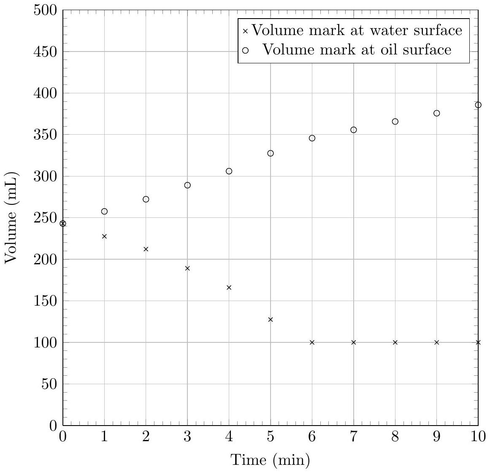

## Question A4

A graduated cylinder is partially filled with water; a rubber duck floats at the surface. Oil is poured into the graduated cylinder at a slow, constant rate, and the volume marks corresponding to the surface of the water and the surface of the oil are recorded as a function of time.

Water has a density of 1.00 g/mL; the density of air is negligible, as are surface effects. Find the density of the oil.

## STOP: Do Not Continue to Part B

If there is still time remaining for Part A, you should review your work for Part A, but do not continue to Part B until instructed by your exam supervisor.

## Part B
