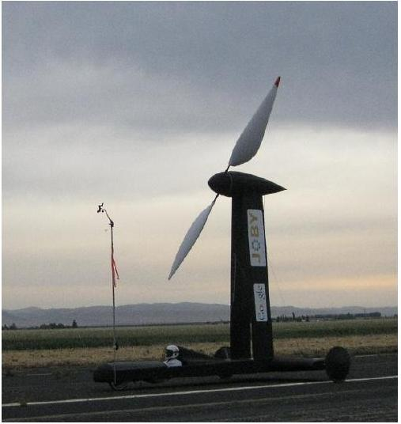
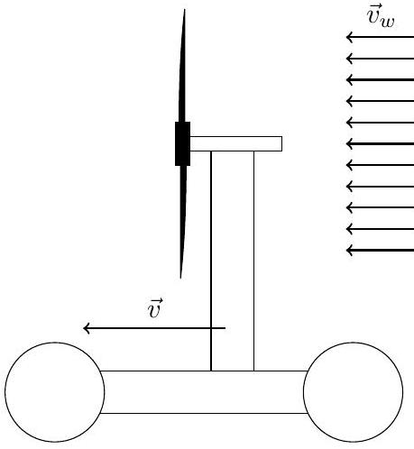
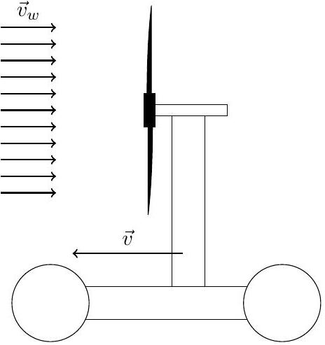

## Question B1

Shown below is the Blackbird, a vehicle built in 2009.
There is no source of stored energy such as a battery or gasoline engine; all of the power used to move the car comes from the wind. The only important mechanism in the car is a gearbox that can transfer power between the wheels and the propeller.

The Blackbird was driven both directly downwind and directly upwind, as shown below. In each case the car remained exactly parallel (or anti-parallel) to the wind without turning. The tests were conducted on level ground, in steady, uniform wind, and continued long enough to reach the steady state.

Source: fasterthanthewind.org

Downwind

Upwind

When driving downwind, the builders claim that they were able to drive "faster than the wind": that is, with $|\vec{v}|>\left|\vec{v}_{w}\right|$, so that the car experienced a relative headwind while traveling. Commenters on the Internet claimed, often angrily, that this was physically impossible and that the Blackbird was a hoax. Some commenters also claimed that the upwind case was physically impossible.

a. Consider first the downwind faster than the wind case.
    - Is the motion actually possible as claimed? If not, offer a brief explanation!
    - If the motion is possible, is power transferred from the propeller to the wheels or vice versa?
    - If the motion is possible, what ground speed is attained? For this question, suppose that when transferring power in either direction between the propeller and the wheels, a fraction $\alpha$ of the useful work is lost; let the wind speed be $v_{w}$. Neglect all other losses of energy.
b. Answer the previous questions for the upwind case.
