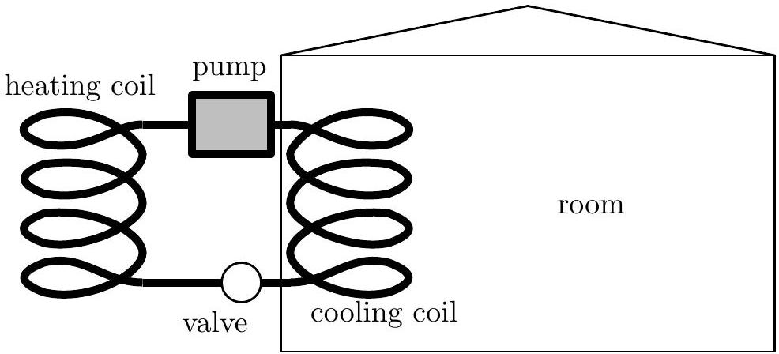

Question A2
A room air conditioner is modeled as a heat engine run in reverse: an amount of heat $Q_{L}$ is absorbed from the room at a temperature $T_{L}$ into cooling coils containing a working gas; this gas is compressed adiabatically to a temperature $T_{H}$; the gas is compressed isothermally in a coil outside the house, giving off an amount of heat $Q_{H}$; the gas expands adiabatically back to a temperature $T_{L}$; and the cycle repeats. An amount of energy $W$ is input into the system every cycle through an electric pump. This model describes the air conditioner with the best possible efficiency.

Assume that the outside air temperature is $T_{H}$ and the inside air temperature is $T_{L}$. The air-conditioner unit consumes electric power $P$. Assume that the air is sufficiently dry so that no condensation of water occurs in the cooling coils of the air conditioner. Water boils at 373 K and freezes at 273 K at normal atmospheric pressure.

a. Derive an expression for the maximum rate at which heat is removed from the room in terms of the air temperatures $T_{H}, T_{L}$, and the power consumed by the air conditioner $P$. Your derivation must refer to the entropy changes that occur in a Carnot cycle in order to receive full marks for this part.
b. The room is insulated, but heat still passes into the room at a rate $R=k \Delta T$, where $\Delta T$ is the temperature difference between the inside and the outside of the room and $k$ is a constant. Find the coldest possible temperature of the room in terms of $T_{H}, k$, and $P$.
c. A typical room has a value of $k=173 \mathrm{~W} /{ }^{\circ} \mathrm{C}$. If the outside temperature is 40°C, what minimum power should the air conditioner have to get the inside temperature down to 25°C?
