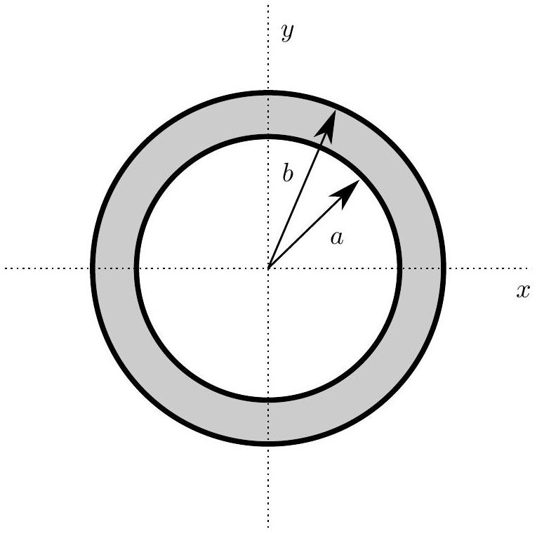

## Question A4

A positive point charge $q$ is located inside a neutral hollow spherical conducting shell. The shell has inner radius $a$ and outer radius $b ; b-a$ is not negligible. The shell is centered on the origin.

a. Assume that the point charge $q$ is located at the origin in the very center of the shell.
    i. Determine the magnitude of the electric field outside the conducting shell at $x=b$.
    ii. Sketch a graph for the magnitude of the electric field along the $x$ axis on the answer sheet provided.
    iii. Determine the electric potential at $x=a$.
    iv. Sketch a graph for the electric potential along the $x$ axis on the answer sheet provided.
b. Assume that the point charge $q$ is now located on the $x$ axis at a point $x=2 a / 3$.
    i. Determine the magnitude of the electric field outside the conducting shell at $x=b$.
    ii. Sketch a graph for the magnitude of the electric field along the $x$ axis on the answer sheet provided.
    iii. Determine the electric potential at $x=a$.
    iv. Sketch a graph for the electric potential along the $x$ axis on the answer sheet provided.
    v. Sketch a figure showing the electric field lines (if any) inside, within, and outside the conducting shell on the answer sheet provided. You should show at least eight field lines in any distinct region that has a non-zero field.

## STOP: Do Not Continue to Part B

If there is still time remaining for Part A, you should review your work for Part A, but do not continue to Part B until instructed by your exam supervisor.

## Part B
