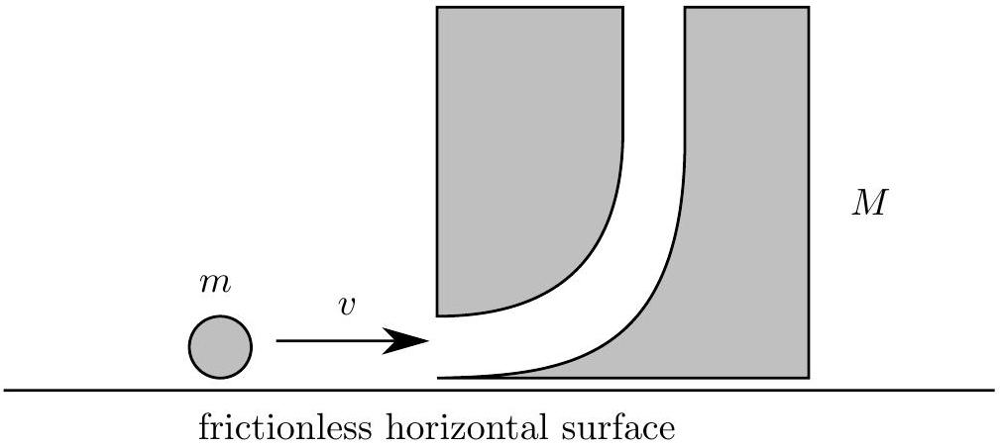

Question B1
A block of mass $M$ has a hole drilled through it so that a ball of mass $m$ can enter horizontally and then pass through the block and exit vertically upward. The ball and block are located on a frictionless surface; the block is originally at rest.

a. Consider the scenario where the ball is traveling horizontally with a speed $v_{0}$. The ball enters the block and is ejected out the top of the block. Assume there are no frictional losses as the ball passes through the block, and the ball rises to a height much higher than the dimensions of the block. The ball then returns to the level of the block, where it enters the top hole and then is ejected from the side hole. Determine the time $t$ for the ball to return to the position where the original collision occurs in terms of the mass ratio $\beta=M / m$, speed $v_{0}$, and acceleration of free fall $g$.
b. Now consider friction. The ball has moment of inertia $I=\frac{2}{5} m r^{2}$ and is originally not rotating. When it enters the hole in the block it rubs against one surface so that when it is ejected upwards the ball is rolling without slipping. To what height does the ball rise above the block?
