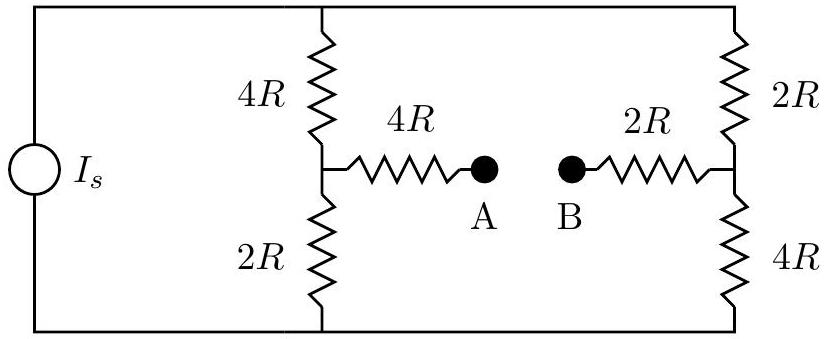
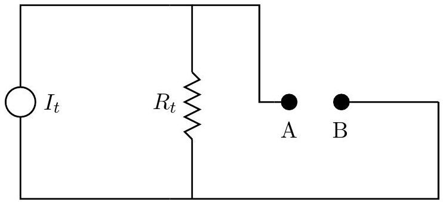

## Question A2

Consider the circuit shown below. $I_{s}$ is a constant current source, meaning that no matter what device is connected between points A and B, the current provided by the constant current source is the same.

a. Connect an ideal voltmeter between $A$ and $B$. Determine the voltage reading in terms of any or all of $R$ and $I_{s}$.
b. Connect instead an ideal ammeter between $A$ and $B$. Determine the current in terms of any or all of $R$ and $I_{s}$.
c. It turns out that it is possible to replace the above circuit with a new circuit as follows:

From the point of view of any passive resistance that is connected between A and B the circuits are identical. You don't need to prove this statement, but you do need to find $I_{t}$ and $R_{t}$ in terms of any or all of $R$ and $I_{s}$.
