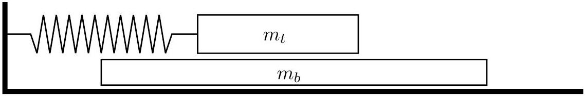

## Question A3

A large block of mass $m_{b}$ is located on a horizontal frictionless surface. A second block of mass $m_{t}$ is located on top of the first block; the coefficient of friction (both static and kinetic) between the two blocks is given by $\mu$. All surfaces are horizontal; all motion is effectively one dimensional. A spring with spring constant $k$ is connected to the top block only; the spring obeys Hooke's Law equally in both extension and compression. Assume that the top block never falls off of the bottom block; you may assume that the bottom block is very, very long. The top block is moved a distance $A$ away from the equilibrium position and then released from rest.

a. Depending on the value of $A$, the motion can be divided into two types: motion that experiences no frictional energy losses and motion that does. Find the value $A_{c}$ that divides the two motion types. Write your answer in terms of any or all of $\mu$, the acceleration of gravity $g$, the masses $m_{t}$ and $m_{b}$, and the spring constant $k$.
b. Consider now the scenario $A \gg A_{c}$. In this scenario the amplitude of the oscillation of the top block as measured against the original equilibrium position will change with time. Determine the magnitude of the change in amplitude, $\Delta A$, after one complete oscillation, as a function of any or all of $A, \mu, g$, and the angular frequency of oscillation of the top block $\omega_{t}$.
c. Assume still that $A \gg A_{c}$. What is the maximum speed of the bottom block during the first complete oscillation cycle of the upper block?
