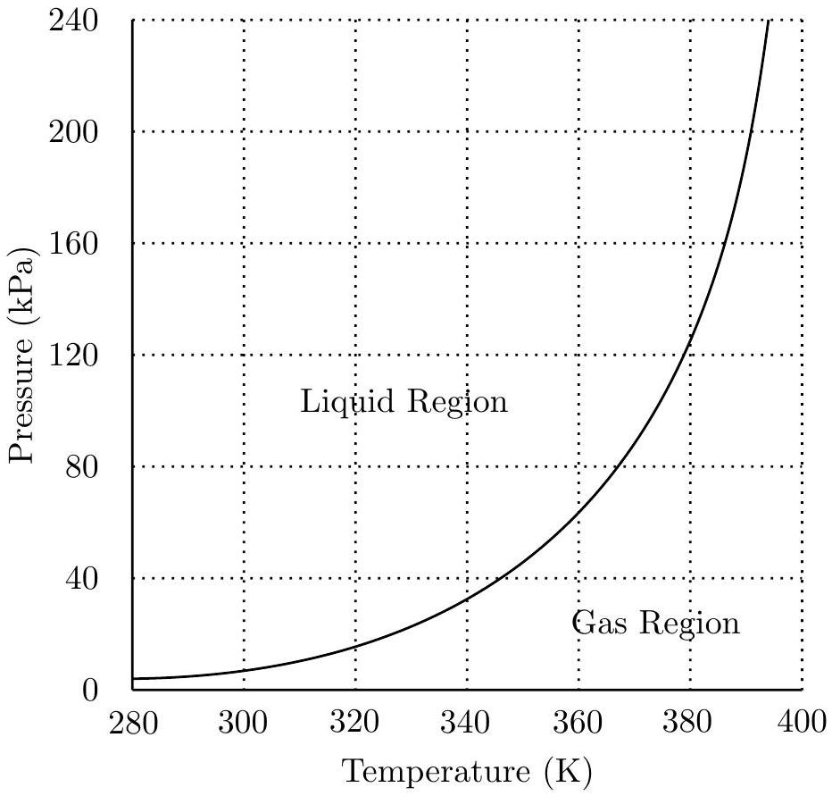

## Question A4

A heat engine consists of a moveable piston in a vertical cylinder. The piston is held in place by a removable weight placed on top of the piston, but piston stops prevent the piston from sinking below a certain point. The mass of the piston is $m=40.0 \mathrm{~kg}$, the cross sectional area of the piston is $A=100 \mathrm{~cm}^{2}$, and the weight placed on the piston has a mass of $m=120.0 \mathrm{~kg}$.

Assume that the region around the cylinder and piston is a vacuum, so you don't need to worry about external atmospheric pressure.

- At point A the cylinder volume $V_{0}$ is completely filled with liquid water at a temperature $T_{0}=320 \mathrm{~K}$ and a pressure $P_{\min }$ that would be just sufficient to lift the piston alone, except the piston has the additional weight placed on top.
- Heat energy is added to the water by placing the entire cylinder in a hot bath.
- At point B the piston and weight begins to rise.
- At point C the volume of the cylinder reaches $V_{\text {max }}$ and the temperature reaches $T_{\text {max }}$. The heat source is removed; the piston stops rising and is locked in place.
- Heat energy is now removed from the water by placing the entire cylinder in a cold bath.
- At point D the pressure in the cylinder returns to $P_{\text {min }}$. The added weight is removed; the piston is unlocked and begins to move down.
- The cylinder volume returns to $V_{0}$. The cylinder is removed from the cold bath, the weight is placed back on top of the piston, and the cycle repeats.

Because the liquid water can change to gas, there are several important events that take place

- At point $\mathbf{W}$ the liquid begins changing to gas.
- At point X all of the liquid has changed to gas. This occurs at the same point as point C described above.
- At point Y the gas begins to change back into liquid.
- At point Z all of the gas has changed back into liquid.

When in the liquid state you need to know that for water kept at constant volume, a change in temperature $\Delta T$ is related to a change in pressure $\Delta P$ according to

$$
\Delta P \approx\left(10^{6} \mathrm{~Pa} / \mathrm{K}\right) \Delta T
$$

When in the gas state you should assume that water behaves like an ideal gas.

Of relevance to this question is the pressure/temperature phase plot for water, showing the regions where water exists in liquid form or gaseous form. The curve shows the coexistence condition, where water can exist simultaneously as gas or liquid.

The following graphs should be drawn on the answer sheet provided.

a. Sketch a PT diagram for this cycle on the answer sheet. The coexistence curve for the liquid/gas state is shown. Clearly and accurately label the locations of points B through D and $\mathbf{W}$ through $\mathbf{Z}$ on this cycle.
b. Sketch a PV diagram for this cycle on the answer sheet. You should estimate a reasonable value for $V_{\text {max }}$, note the scale is logarithmic. Clearly and accurately label the locations of points B through D on this cycle. Provide reasonable approximate locations for points W through $\mathbf{Z}$ on this cycle.

## STOP: Do Not Continue to Part B

If there is still time remaining for Part A, you should review your work for Part A, but do not continue to Part B until instructed by your exam supervisor.

## Part B
