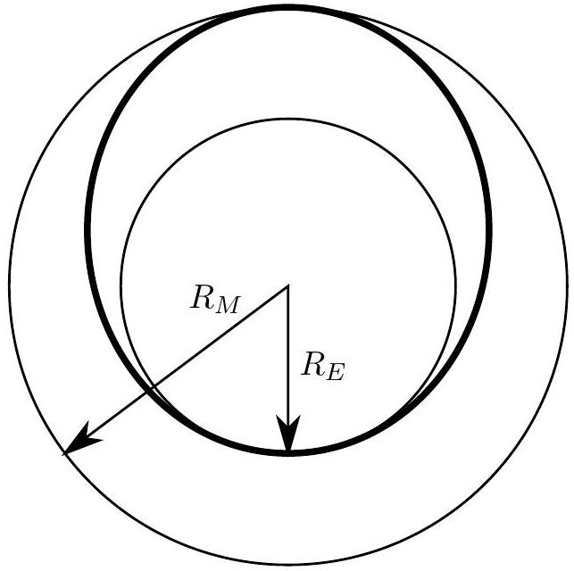

## Question B1

This problem is divided into three parts. It is possible to solve these three parts independently, but they are not equally weighted.

a. An ideal rocket when empty of fuel has a mass $m_{r}$ and will carry a mass of fuel $m_{f}$. The fuel burns and is ejected with an exhaust speed of $v_{e}$ relative to the rocket. The fuel burns at a constant mass rate for a total time $T_{b}$. Ignore gravity; assume the rocket is far from any other body.
    i. Determine an equation for the acceleration of the rocket as a function of time $t$ in terms of any or all of $t, m_{f}, m_{r}, v_{e}, T_{b}$, and any relevant fundamental constants.
    ii. Assuming that the rocket starts from rest, determine the final speed of the rocket in terms of any or all of $m_{r}, m_{f}, v_{e}, T_{b}$, and any relevant fundamental constants.
b. The ship starts out in a circular orbit around the sun very near the Earth and has a goal of moving to a circular orbit around the Sun that is very close to Mars. It will make this transfer in an elliptical orbit as shown in bold in the diagram below. This is accomplished with an initial velocity boost near the Earth $\Delta v_{1}$ and then a second velocity boost near Mars $\Delta v_{2}$. Assume that both of these boosts are from instantaneous impulses, and ignore mass changes in the rocket as well as gravitational attraction to either Earth or Mars. Don't ignore the Sun! Assume that the Earth and Mars are both in circular orbits around the Sun of radii $R_{E}$ and $R_{M}=R_{E} / \alpha$ respectively. The orbital speeds are $v_{E}$ and $v_{M}$ respectively.

i. Derive an expression for the velocity boost $\Delta v_{1}$ to change the orbit from circular to elliptical. Express your answer in terms of $v_{E}$ and $\alpha$.
ii. Derive an expression for the velocity boost $\Delta v_{2}$ to change the orbit from elliptical to circular. Express your answer in terms of $v_{E}$ and $\alpha$.
iii. What is the angular separation between Earth and Mars, as measured from the Sun, at the time of launch so that the rocket will start from Earth and arrive at Mars when it reaches the orbit of Mars? Express your answer in terms of $\alpha$.
