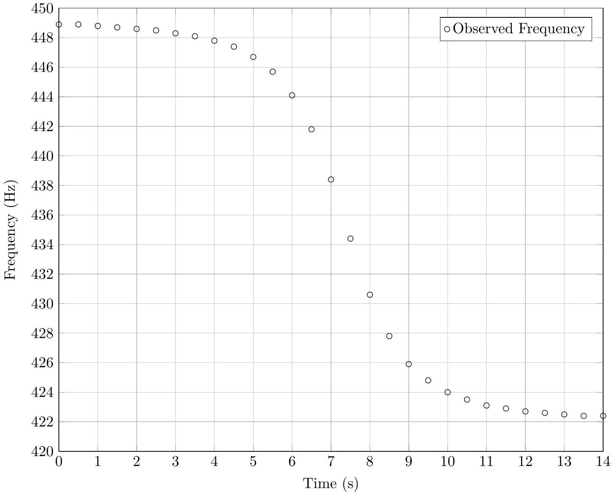

Question A1
The Doppler effect for a source moving relative to a stationary observer is described by

$$
f=\frac{f_{0}}{1-(v / c) \cos \theta}
$$

where $f$ is the frequency measured by the observer, $f_{0}$ is the frequency emitted by the source, $v$ is the speed of the source, $c$ is the wave speed, and $\theta$ is the angle between the source velocity and the line between the source and observer. (Thus $\theta=0$ when the source is moving directly towards the observer and $\theta=\pi$ when moving directly away.)

A sound source of constant frequency travels at a constant velocity past an observer, and the observed frequency is plotted as a function of time:

The experiment happens in room temperature air, so the speed of sound is 340 m/s.

a. What is the speed of the source?
b. What is the smallest distance between the source and the observer?
