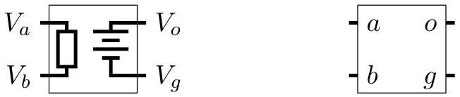
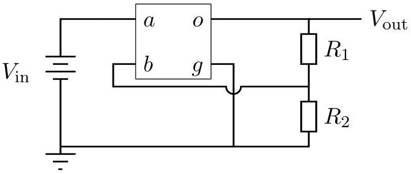
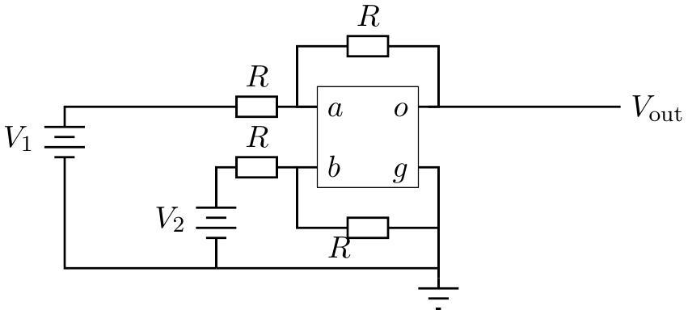
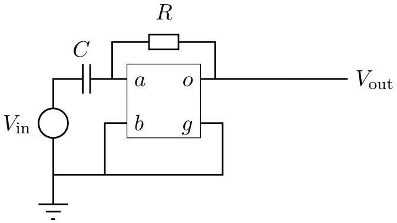

Question A2
A student designs a simple integrated circuit device that has two inputs, $V_{a}$ and $V_{b}$, and two outputs, $V_{o}$ and $V_{g}$. The inputs are effectively connected internally to a single resistor with effectively infinite resistance. The outputs are effectively connected internally to a perfect source of $\operatorname{emf} \mathcal{E}$. The integrated circuit is configured so that $\mathcal{E}=G\left(V_{a}-V_{b}\right)$, where $G$ is a very large number somewhere between $10^{7}$ and $10^{9}$. The circuits below are chosen so that the precise value of $G$ is unimportant. On the left is an internal schematic for the device; on the right is the symbol that is used in circuit diagrams.

a. Consider the following circuit. $R_{1}=8.2 k \Omega$ and $R_{2}=560 \Omega$ are two resistors. Terminal $g$ and the negative side of $V_{\text {in }}$ are connected to ground, so both are at a potential of 0 volts. Determine the ratio $V_{\text {out }} / V_{\text {in }}$.

b. Consider the following circuit. All four resistors have identical resistance $R$. Determine $V_{\text {out }}$ in terms of any or all of $V_{1}, V_{2}$, and $R$.

c. Consider the following circuit. The circuit has a capacitor $C$ and a resistor $R$ with time constant $R C=\tau$. The source on the left provides variable, but bounded voltage. Assume $V_{\text {in }}$ is a function of time. Determine $V_{\text {out }}$ as a function of $V_{\text {in }}$, and any or all of time $t$ and $\tau$.

