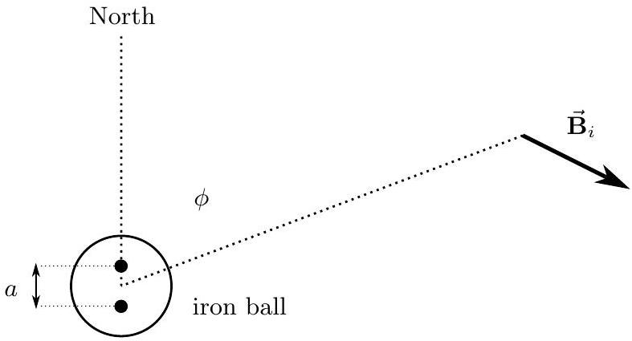

## Question A3

A ship can be thought of as a symmetric arrangement of soft iron. In the presence of an external magnetic field, the soft iron will become magnetized, creating a second, weaker magnetic field. We want to examine the effect of the ship's field on the ship's compass, which will be located in the middle of the ship.

Let the strength of the Earth's magnetic field near the ship be $B_{e}$, and the orientation of the field be horizontal, pointing directly toward true north.

The Earth's magnetic field $B_{e}$ will magnetize the ship, which will then create a second magnetic field $B_{s}$ in the vicinity of the ship's compass given by

$$
\overrightarrow{\mathbf{B}}_{s}=B_{e}\left(-K_{b} \cos \theta \hat{\mathbf{b}}+K_{s} \sin \theta \hat{\mathbf{s}}\right)
$$

where $K_{b}$ and $K_{s}$ are positive constants, $\theta$ is the angle between the heading of the ship and magnetic north, measured clockwise, $\hat{\mathbf{b}}$ and $\hat{\mathbf{s}}$ are unit vectors pointing in the forward direction of the ship (bow) and directly right of the forward direction (starboard), respectively.

Because of the ship's magnetic field, the ship's compass will no longer necessarily point North.

a. Derive an expression for the deviation of the compass, $\delta \theta$, from north as a function of $K_{b}$, $K_{s}$, and $\theta$.
b. Assuming that $K_{b}$ and $K_{s}$ are both much smaller than one, at what heading(s) $\theta$ will the deviation $\delta \theta$ be largest?

A pair of iron balls placed in the same horizontal plane as the compass but a distance $d$ away can be used to help correct for the error caused by the induced magnetism of the ship.

A binnacle, protecting the ship's compass in the center, with two soft iron spheres to help correct for errors in the compass heading. The use of the spheres was suggested by Lord Kelvin.

Just like the ship, the iron balls will become magnetic because of the Earth's field $B_{e}$. As spheres, the balls will individually act like dipoles. A dipole can be thought of as the field produced by two magnetic monopoles of strength $\pm m$ at two different points.

Copyright ©2017 American Association of Physics Teachers

The magnetic field of a single pole is

$$
\overrightarrow{\mathbf{B}}= \pm m \frac{\hat{\mathbf{r}}}{r^{2}}
$$

where the positive sign is for a north pole and the negative for a south pole. The dipole magnetic field is the sum of the two fields: a north pole at $y=+a / 2$ and a south pole at $y=-a / 2$, where the $y$ axis is horizontal and pointing north. $a$ is a small distance much smaller than the radius of the iron balls; in general $a=K_{i} B_{e}$ where $K_{i}$ is a constant that depends on the size of the iron sphere.

c. Derive an expression for the magnetic field $\overrightarrow{\mathbf{B}}_{i}$ from the iron a distance $d \gg a$ from the center of the ball. Note that there will be a component directed radially away from the ball and a component directed tangent to a circle of radius $d$ around the ball, so using polar coordinates is recommended.
d. If placed directly to the right and left of the ship compass, the iron balls can be located at a distance $d$ to cancel out the error in the magnetic heading for any angle(s) where $\delta \theta$ is largest. Assuming that this is done, find the resulting expression for the combined deviation $\delta \theta$ due to the ship and the balls for the magnetic heading for all angles $\theta$.
