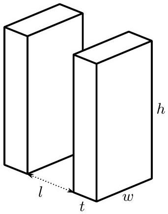
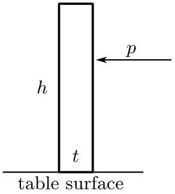
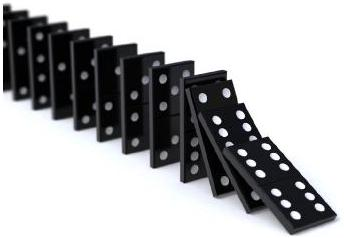

## Question B1

Suppose a domino stands upright on a table. It has height $h$, thickness $t$, width $w$ (as shown below), and mass $m$. The domino is free to rotate about its edges, but will not slide across the table.

a. Suppose we give the domino a sharp, horizontal impulsive push with total momentum $p$.
    i. At what height $H$ above the table is the impulse $p$ required to topple the domino smallest?
    ii. What is the minimum value of $p$ to topple the domino?
b. Next, imagine a long row of dominoes with equal spacing $l$ between the nearest sides of any pair of adjacent dominos, as shown above. When a domino topples, it collides with the next domino in the row. Imagine this collision to be completely inelastic. What fraction of the total kinetic energy is lost in the collision of the first domino with the second domino?
c. After the collision, the dominoes rotate in such a way so that they always remain in contact. Assume that there is no friction between the dominoes and the first domino was given the smallest possible push such that it toppled. What is the minimum $l$ such that the second domino will topple?
You may work to lowest nontrivial order in the angles through which the dominoes have rotated. Equivalently, you may approximate $t, l \ll h$.
d. A row of toppling dominoes can be considered to have a propagation speed of the length $l+t$ divided by the time between successive collisions. When the first domino is given a minimal push just large enough to topple and start a chain reaction of toppling dominoes, the speed increases with each domino, but approaches an asymptotic speed $v$.

Suppose there is a row of dominoes on another planet. These dominoes have the same density as the dominoes previously considered, but are twice as tall, wide, and thick, and placed with a spacing of $2 l$ between them. If this row of dominoes topples with the same asymptotic speed $v$ previously found, what is the local gravitational acceleration on this planet?
