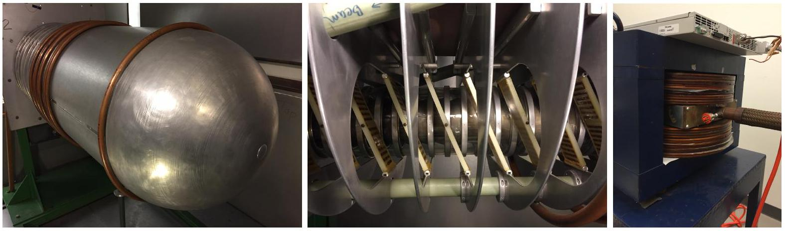
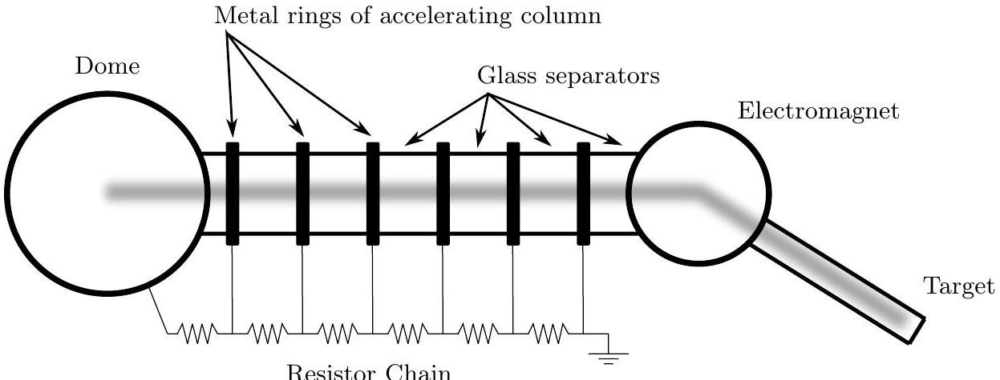
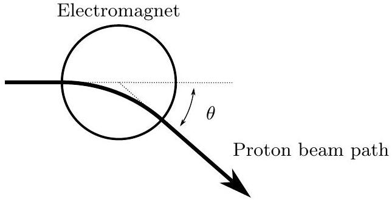
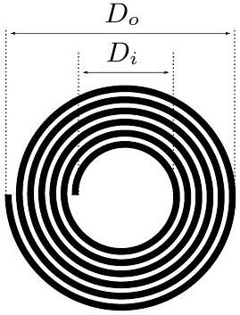

## Question B2

Beloit College has a "homemade" 500 kV VanDeGraff proton accelerator, designed and constructed by the students and faculty.

Accelerator dome (assume it is a sphere); accelerating column; bending electromagnet

The accelerator dome, an aluminum sphere of radius $a=0.50$ meters, is charged by a rubber belt with width $w=10 \mathrm{~cm}$ that moves with speed $v_{b}=20 \mathrm{~m} / \mathrm{s}$. The accelerating column consists of 20 metal rings separated by glass rings; the rings are connected in series with $500 \mathrm{M} \Omega$ resistors. The proton beam has a current of $25 \mu \mathrm{~A}$ and is accelerated through 500 kV and then passes through a tuning electromagnet. The electromagnet consists of wound copper pipe as a conductor. The electromagnet effectively creates a uniform field $B$ inside a circular region of radius $b=10 \mathrm{~cm}$ and zero outside that region.

Only six of the 20 metals rings and resistors are shown in the figure. The fuzzy grey path is the path taken by the protons as they are accelerated from the dome, through the electromagnet, into the target.

a. Assuming the dome is charged to 500 kV, determine the strength of the electric field at the surface of the dome.
b. Assuming the proton beam is off, determine the time constant for the accelerating dome (the time it takes for the charge on the dome to decrease to $1 / e \approx 1 / 3$ of the initial value.
c. Assuming the $25 \mu \mathrm{~A}$ proton beam is on, determine the surface charge density that must be sprayed onto the charging belt in order to maintain a steady charge of 500 kV on the dome.

d. The proton beam enters the electromagnet and is deflected by an angle $\theta=10^{\circ}$. Determine the magnetic field strength.

e. The electromagnet is composed of layers of spiral wound copper pipe; the pipe has inner diameter $d_{i}=0.40 \mathrm{~cm}$ and outer diameter $d_{o}=0.50 \mathrm{~cm}$. The copper pipe is wound into this flat spiral that has an inner diameter $D_{i}=20 \mathrm{~cm}$ and outer diameter $D_{o}=50 \mathrm{~cm}$. Assuming the pipe almost touches in the spiral winding, determine the length $L$ in one spiral.

f. Hollow pipe is used instead of solid conductors in order to allow for cooling of the magnet. If the resistivity of copper is $\rho=1.7 \times 10^{-8} \Omega \cdot \mathrm{~m}$, determine the electrical resistance of one spiral.
g. There are $N=24$ coils stacked on top of each other. Tap water with an initial temperature of $T_{c}=18^{\circ} \mathrm{C}$ enters the spiral through the copper pipe to keep it from over heating; the water exits at a temperature of $T_{h}=31^{\circ} \mathrm{C}$. The copper pipe carries a direct 45 Amp current in order to generate the necessary magnetic field. At what rate must the cooling water flow be provided to the electromagnet? Express your answer in liters per second with only one significant digit. The specific heat capacity of water is 4200 J/°C ⋅ kg; the density of water is $1000 \mathrm{~kg} / \mathrm{m}^{3}$.
h. The protons are fired at a target consisting of Fluorine atoms $(Z=9)$. What is the distance of closest approach to the center of the Fluorine nuclei for the protons? You can assume that the Fluorine does not move.
