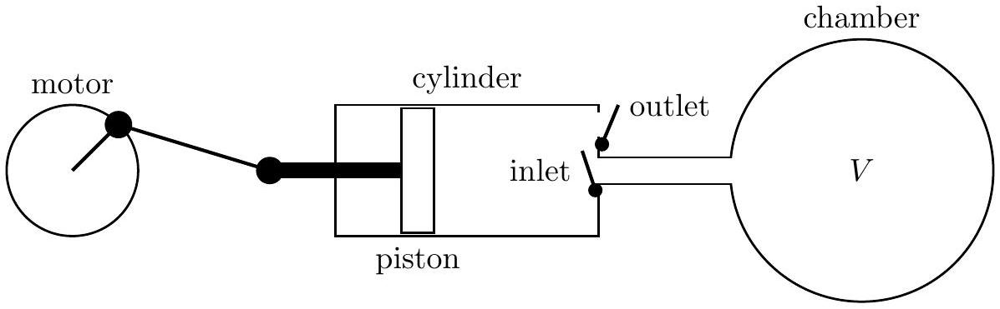

## Question A3

A vacuum system consists of a chamber of volume $V$ connected to a vacuum pump that is a cylinder with a piston that moves left and right. The minimum volume in the pump cylinder is $V_{0}$, and the maximum volume in the cylinder is $V_{0}+\Delta V$. You should assume that $\Delta V \ll V$.

The cylinder has two valves. The inlet valve opens when the pressure inside the cylinder is lower than the pressure in the chamber, but closes when the piston moves to the right. The outlet valve opens when the pressure inside the cylinder is greater than atmospheric pressure $P_{a}$, and closes when the piston moves to the left. A motor drives the piston to move back and forth. The piston moves at such a rate that heat is not conducted in or out of the gas contained in the cylinder during the pumping cycle. One complete cycle takes a time $\Delta t$. You should assume that $\Delta t$ is a very small quantity, but $\Delta V / \Delta t=R$ is finite. The gas in the chamber is ideal monatomic and remains at a fixed temperature of $T_{a}$.

Start with assumption that $V_{0}=0$ and there are no leaks in the system.

a. At $t=0$ the pressure inside the chamber is $P_{a}$. Find an equation for the pressure at a later time $t$.
b. Find an expression for the temperature of the gas as it is emitted from the pump cylinder into the atmosphere. Your answer may depend on time.

For the remainder of this problem $0<V_{0}<\Delta V \ll V$.

c. Find an expression for the minimum possible pressure in the chamber, $P_{\text {min }}$.

## STOP: Do Not Continue to Part B

If there is still time remaining for Part A, you should review your work for Part A, but do not continue to Part B until instructed by your exam supervisor.

## Part B
