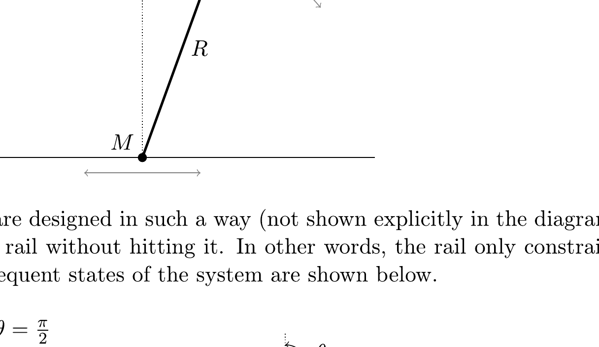
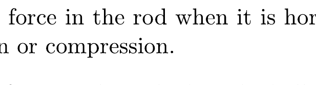
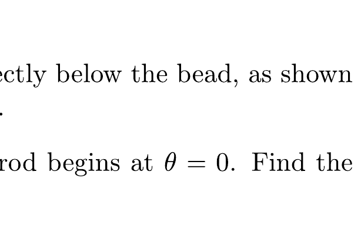

## Question B3

## Pitfall

A bead is placed on a horizontal rail, along which it can slide frictionlessly. It is attached to the end of a rigid, massless rod of length $R$. A ball is attached at the other end. Both the bead and the ball have mass $M$. The system is initially stationary, with the ball directly above the bead. The ball is then given an infinitesimal push, parallel to the rail.

Assume that the rod and ball are designed in such a way (not shown explicitly in the diagram) so that they can pass through the rail without hitting it. In other words, the rail only constrains the motion of the bead. Two subsequent states of the system are shown below.

a. Derive an expression for the force in the rod when it is horizontal, as shown at left above, and indicate whether it is tension or compression.
b. Derive an expression for the force in the rod when the ball is directly below the bead, as shown at right above, and indicate whether it is tension or compression.
c. Let $\theta$ be the angle the rod makes with the vertical, so that the rod begins at $\theta=0$. Find the angular velocity $\omega=d \theta / d t$ as a function of $\theta$.
