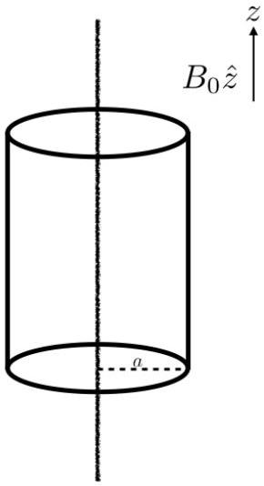

## Question A1

## Braking up

An infinitely long wire with linear charge density $-\lambda$ lies along the $z$-axis. An infinitely long insulating cylindrical shell of radius $a$ is concentric with the wire and can rotate freely about the $z$-axis. The shell has moment of inertia per unit length $I$. Charge is uniformly distributed on the shell, with surface charge density $\frac{\lambda}{2 \pi a}$.

The system is immersed in an external magnetic field $B_{0} \hat{\mathbf{z}}$, and is initially at rest. Starting at $t=0$, the external magnetic field is slowly reduced to zero over a time $T \gg a / c$, where $c$ is the speed of light.

a. Find an expression of the final angular velocity $\omega$ of the cylinder in terms of the symbols given and other constants.
b. You may be surprised that the expression you find above is not zero! However, the electric and magnetic fields can have angular momentum. Analogous to the "regular" angular momentum definition, the EM field angular momentum per unit volume at a displacement r from the axis of rotation is:
$$
\mathcal{L}(\mathbf{r})=\mathbf{r} \times \mathcal{P}(\mathbf{r}) .
$$
$\mathcal{P}(\mathbf{r})$ is a vector analogous to momentum, given by
$$
\mathcal{P}(\mathbf{r})=\alpha \cdot(\mathbf{E}(\mathbf{r}) \times \mathbf{B}(\mathbf{r})) .
$$
where $\alpha$ is some proportionality constant. Find an expression for $\alpha$ in terms of given variables and fundamental constants.
