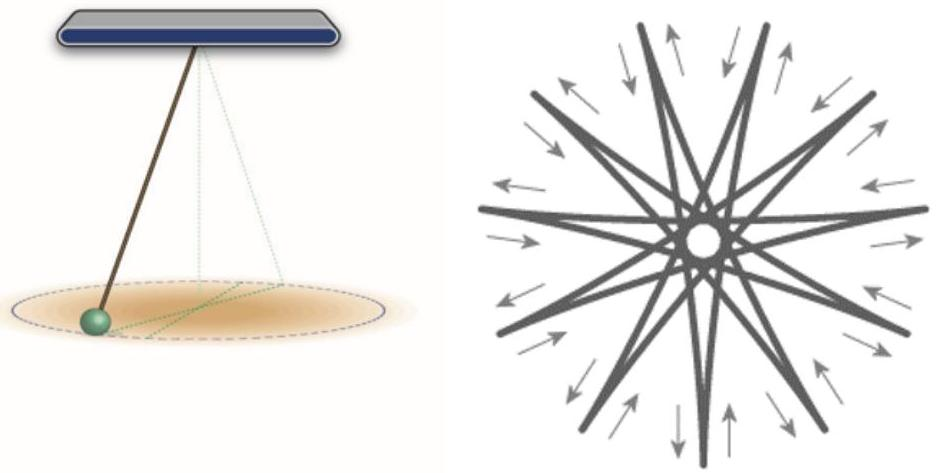
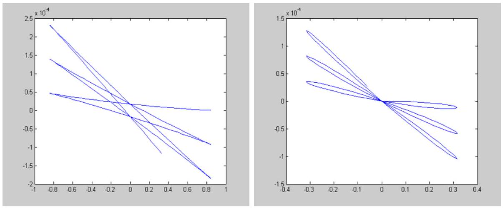

## Question A2

## Swoosh!

In 1851, Léon Foucault built a pendulum 67 metres tall with a 28-kg weight. He connected it to the top of the Panthéon in Paris with a bearing that enabled it to freely change its plane of oscillation. Because of the Earth's rotation, the plane of oscillation slowly moved over time: if we imagine a large horizontal clock under the pendulum, if initially the oscillations went from " 12 " to " 6 ", later on they would move to the "3-9" plane, for example, as shown in the figure below. Perhaps surprisingly, the time it took the oscillations to go back to their original plane is longer than 12 hours. In this problem we will investigate why this is the case, and what the shape the pendulum traces out.

Figure 1: Left: A schematic of Foucault's pendulum. Right: The pendulum motion projected on a horizontal plane in the rotating lab frame.

First, consider the case of a Foucault pendulum installed precisely at the North Pole, with length $l$. We denote $\sqrt{g / l}=\omega$. The angular velocity of the Earth is $\Omega$.

John is an observer looking at the pendulum from a fixed point in space. At $t=0$, he sees the pendulum at position $(A, 0)$ and with velocity $(0, V)$ in the $x-y$ (horizontal) plane.

a. For John, what are the approximate equations describing the motion of the pendulum in the $x-y$ plane? You may assume that the amplitude of the oscillations is small. We define the coordinates of the pendulum at rest as $(0,0)$.
b. What will the coordinates $x, y$ in Jonh's frame be at a later time $t$ ?
c. Ella, an observer resides at the North Pole, is also looking at the pendulum. What are the coordinates, $\tilde{x}(t)$ and $\tilde{y}(t)$, as observed by Ella? Assume that at time $t=0$, the coordinate systems of John's and Ella's overlap.
d. What is the speed of the pendulum bob observed by Ella at $t=0$ ?
e. Find the initial conditions for $A, V$, such that as measured in Ella's frame:
    i. the pendulum passes precisely through its resting position.
    ii. it has a "spike" at the points of maximal amplitude (see figure below) instead of a "rounded" trajectory.

Figure 2: Two possible trajectories with "spike" (left) and more "rounded" (right).

In a rotating frame, a fictitious force known as the Coriolis force acts on the particles. For Foucault's pendulum, the Coriolis force acts primarily in the horizontal plane, in a direction perpendicular to the velocity of the mass in the Earth's frame with magnitude:

$$
F=2 m \Omega v \cdot \sin \theta,
$$

where $m$ and $v$ are the pendulum's mass and its velocity, and $\theta$ the latitude ( $90^{\circ}$ for the North Pole). Note that when the velocity changes sign, so does the Coriolis force.

f. How long would it take for the plane of oscillation of Foucault's pendulum to return to its initial value in Paris, which has a latitude of about 49°.
