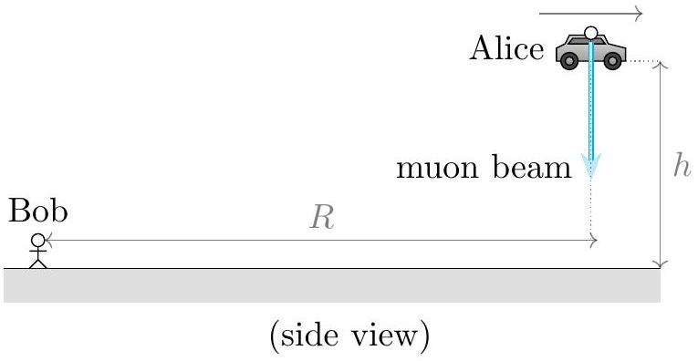
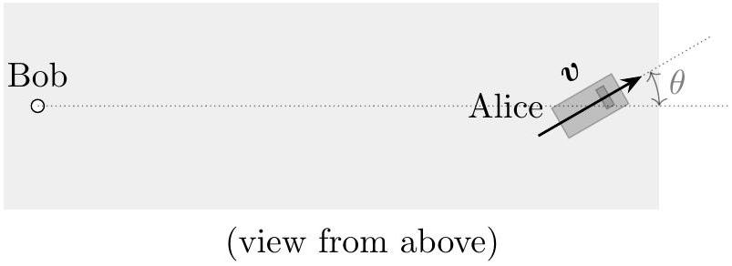

## Question A2

## Flashlight

Alice the Mad Scientist, travelling in her flying car at height $h$ above the ground, shoots a beam of muons at the ground. Bob, observing from the ground at distance $R \gg h$ from Alice's car, decides to check some facts about special relativity. Assume the muons travel extremely close to the speed of light in Alice's frame.

a. Alice's car flies at horizontal speed $v=\beta c$. Alice shoots her muon beam straight down, in her reference frame. Express your answers in terms of $\beta, h, R$ and fundamental constants.
    i. What is the horizontal velocity of the muons in Bob's reference frame?
    ii. What is the vertical velocity of the muons in Bob's reference frame?
    iii. How long does it take the muons to reach the ground in Bob's reference frame?

Alice's velocity $v$ is directed an angle $\theta$ away from Bob. For the rest of the problem, you may additionally express your answers in terms of $\theta$.

b. In Bob's reference frame, how much time is there between when he sees Alice first fire the beam, and when he sees the beam first hit the ground? (Hint: remember to account for the travel time of light to Bob's eyes.)
c. In this part, suppose that $\beta=1 / 2$. Does there exist a value of $\theta$ so that the time it takes the muons to hit the ground in Alice's frame is equal to the time taken according to Bob's eyes, in Bob's frame? If so, find the value of $\theta$ in degrees. If not, briefly explain why not.
d. Suppose Alice is carrying a radio transmitter set to frequency $f$. To what frequency would Bob have to set his radio receiver in order to receive Alice's transmission?
