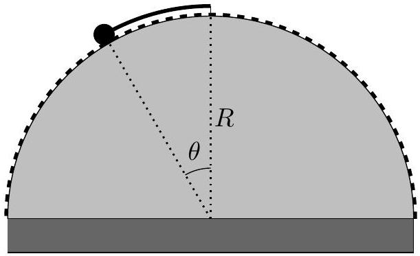
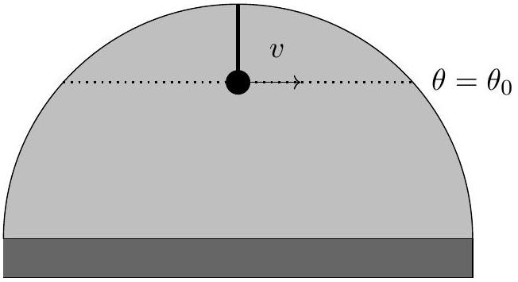
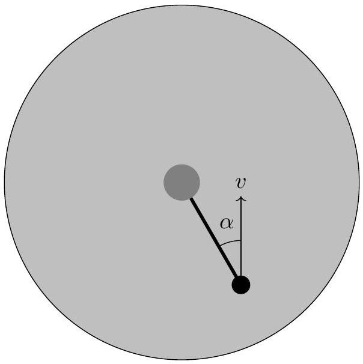

## Question B3

## The Mad Hatter

A frictionless hemisphere of radius $R$ is fixed on top of a flat cylinder. One end of a spring with zero relaxed length and spring constant $k$ (i.e. the force from the spring when stretched to length $\ell$ is $-k \ell$ ) is fixed to the top of the hemisphere. Its other end is attached to a point mass of mass $m$.

a. The number and nature of the equilibrium points on the hemisphere depends on the value of the spring constant $k$. Consider the semicircular arc shown above as a dashed line, which is parameterized by angles in the range $-\pi / 2 \leq \theta \leq \pi / 2$. Make a table indicating the number of equilibrium points on the arc, and the number that are stable, for each range of $k$ values. A blank table for your reference is given below. (You may need more or fewer rows than shown.)

| Range of $k\left(k_{\text {min }}<k<k_{\text {max }}\right)$ | \# of Equilibria | \# of Stable Equilibria |
| :--- | :--- | :--- |
| $0<k<$ ? |  |  |
|  |  |  |
|  |  |  |
| $?<k<\infty$ |  |  |

For the rest of the problem, suppose the value of $k$ is such that the mass begins at stable equilibrium on the surface of the hemisphere at angle $\theta_{0}$. The mass can move on the two-dimensional surface of the hemisphere, but a radially-inward external force prevents it from jumping off the surface.

b. At $t=0$, the mass is given a speed $v$ along a line of constant latitude $\theta=\theta_{0}$.

    i. Indicate which of the following trajectories the mass takes for a short time after $t=0$ and briefly explain your reasoning. The differences between the paths are exaggerated.

ii. What is the total radial force (i.e., normal to the surface of the hemisphere) on the mass at $t=0$ ? Express your answer in terms of $m, v, R, g$, and $\theta_{0}$.
c.A cylinder of radius $r \ll R \theta_{0}$ is placed on top of the sphere. Suppose the mass is launched at an angle $\alpha$ away from the direction of the spring's displacement with kinetic energy $K$, as shown. What is the maximum angle $\alpha_{\text {max }}$ at which the mass can be launched such that it can still hit the cylinder? Express your answer in terms of $K, m, g, \theta_{0}, r$, and $R$. You may assume $K$ is large enough for the mass to reach the cylinder for $\alpha=0$.

(view from above)
