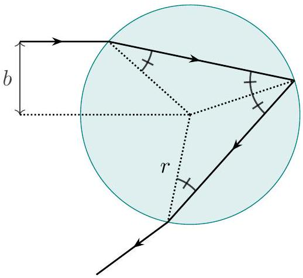
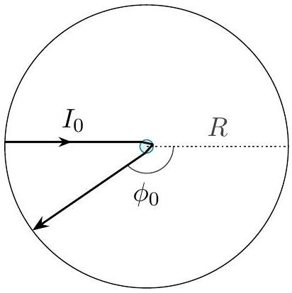

## Question A3

## Rainbow Road

In geometric optics, a caustic is a bright curve of light that appears when many incoming light rays are focused in the same outgoing direction. The most famous example of a caustic is a rainbow, which occurs when light interacts with spherical water droplets. Consider a spherical liquid droplet of radius $r$ with index of refraction $1<n<2$, suspended in air with index of refraction $n=1$.

a. Consider a light ray that enters the droplet with impact parameter $b$, reflects once off the inside surface of the droplet, then exits, as shown at left below. Give your answers in terms of the dimensionless impact parameter $x=b / r$. (Hint: the four marked angles are congruent.)

    i. Find the angle by which the light ray is deflected at the first refraction.
    ii. Find the angle by which the light ray is deflected at the reflection.
    iii. Find the angle by which the light ray is deflected at the second refraction.

The sum of these three quantities is the net deflection angle $\phi(x)$. (The light can also reflect inside more than once, or never enter at all, but for simplicity we will ignore these other paths.)

b. Next, we consider when caustics form in general. Suppose the droplet is uniformly illuminated by parallel light rays of intensity $I_{0}$, and sits at the center of a spherical screen of radius $R \gg r$, as shown at right above. Consider the light that enters near dimensionless impact parameter $x_{0}$, and exits near angle $\phi_{0}=\phi\left(x_{0}\right)$.
    i. What is the power incident on the droplet at $x_{0} \leq x \leq x_{0}+d x$ ?
    ii. What is the area on the screen illuminated by the outgoing rays, at $\phi_{0} \leq \phi \leq \phi_{0}+d \phi$ ?
    iii. A caustic occurs when the intensity of light on the screen diverges. Assume that $\phi_{0} \neq 0$ and $\phi_{0} \neq \pi$. Under what conditions does light incident at $x_{0}$ lead to a caustic at $\phi_{0}$ ? Express your answer as a condition on the function $\phi(x)$.
c. Find the angle $\phi_{0}$ of the rainbow in terms of $n$. (Hint: the derivative of $\arcsin (x)$ is $1 / \sqrt{1-x^{2}}$.)
d. For water, the index of refraction of red light is 1.331, and the index of refraction of blue light is 1.340. Find the angular width of the rainbow on the screen and give your answer in degrees.
e. A glory is an optical phenomenon which involves light scattered directly backward, at $\phi=\pi$, leading to an apparent halo around the shadow of an observer's head. For what values of $n$ is there a caustic at $\phi=\pi$ ? Can glories from water droplets be explained in terms of caustics?

## STOP: Do Not Continue to Part B

If there is still time remaining for Part A, you should review your work for Part A, but do not continue to Part B until instructed by your exam supervisor.

Once you start Part B, you will not be able to return to Part A.

## Part B
