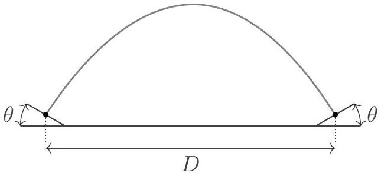
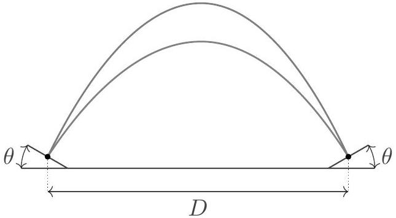
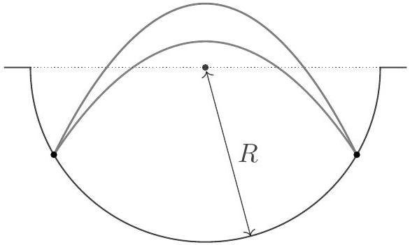

## Question A1

## Circus Act

In this problem we consider a small ball bouncing back and forth between two points. In all parts below, the acceleration of gravity is $g$, collisions are perfectly elastic, air resistance is negligible, and the impact points are at the same height. The diagrams are not drawn to scale.

a. Consider a ball bouncing between two inclined planes, which each make an angle $\theta<90^{\circ}$ to the horizontal. The ball has speed $v_{0}$ at the impact points, which are separated by a distance $D$.
    i. The ball can bounce back and forth along the same path, as shown.

For what values of $\theta$ is this motion possible? For these values, what is $v_{0}$ ?
    ii. The ball can also take one trajectory while traveling to the right, and a separate trajectory when traveling back. Let $\phi \neq 0$ be the angle between the paths at the impact points.

For what values of $\theta$ and $\phi$ is this motion possible? For these values, what is $v_{0}$ ?
b. Now suppose the ball bounces within a hemispherical well of radius of curvature $R$. As in part a.ii, it alternates between two distinct paths, with flight times $t_{1}$ and $t_{2} \neq t_{1}$.

Find all of the possible values of $R$, in terms of $t_{1}$ and $t_{2}$.
c. Finally, suppose the well has a sinusoidal shape, described by $y(x)=-L \sin (2 x / L)$. The ball takes two distinct paths with flight times $t_{1}$ and $t_{2} \neq t_{1}$, and the horizontal distance between the impact points is less than $\pi L$. Find all of the possible values of $L$, in terms of $t_{1}$ and $t_{2}$.
