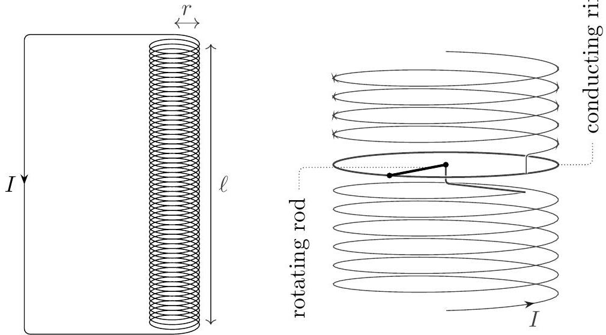

## Question B1

## Electric Roulette

Consider a cylindrical solenoid with radius $r$, length $\ell \gg r$, and $n$ turns per unit length. It is made of one continuous wire, with the top connecting back to the bottom as shown at left.

In the middle of the solenoid, part of the wire is replaced with the assembly shown at right. A uniform conducting rod of mass $m$ and radius $r$ is connected to the bottom half of the solenoid, and is free to rotate about the solenoid's axis of symmetry. The end of the rod slides on a fixed conducting ring, which is attached to the top half of the solenoid. This assembly and the solenoid form one continuous conductor, carrying total current $I$.

a. What is the inductance of this system? Assume $n r \gg 1$, so that the magnetic field produced by the current in the rod and ring is negligible.
b. When the rod is within a uniform vertical magnetic field $B$, find the torque it experiences in terms of $I, B$, and $r$.
c. If the rod rotates with angular velocity $\omega$, the electrons inside have a tangential velocity. Find the electromotive force across the rod in terms of $\omega, B$, and $r$.

Now we will consider the dynamics of this system in some simple situations. For all the parts below, neglect energy losses due to friction, resistance, and radiation.

d. First, suppose the system initially carries no current, and the entire system is inside a uniform external magnetic field $B_{0}$ parallel to the axis of the solenoid. If the rod is given a small initial angular velocity, its angular velocity will oscillate in time. Find the period of these oscillations.
e. Next, suppose there is no external magnetic field, $B_{0}=0$, and at time $t=0$, the system carries current $I_{0}$ and the rod has zero angular velocity.
    i. The rod's angular velocity $\omega(t)$ approaches a value $\omega_{0}$ after a long time. What is $\omega_{0}$ ?
    ii. Find $\omega(t) / \omega_{0}$ in terms of $\omega_{0}, t, n$, and $\ell$. You may use the integrals on the reference sheet.
