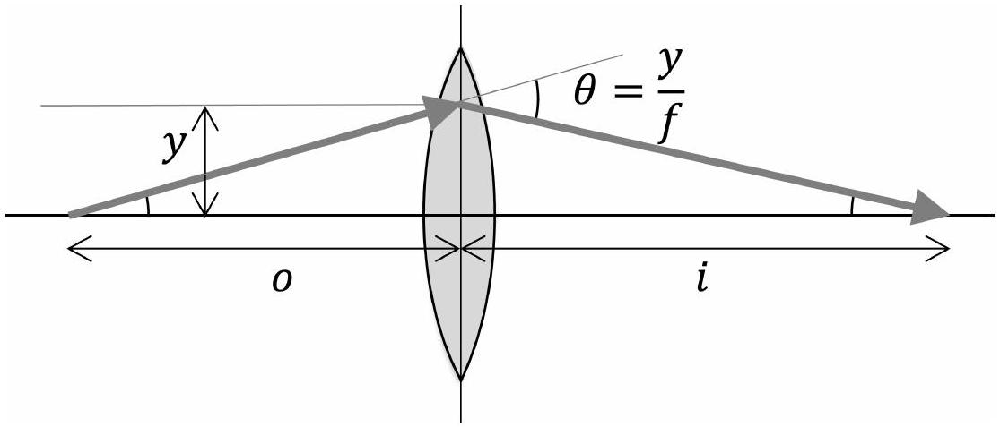

## Question A3

## Tilt Shift

An ideal converging lens of focal length $f$ is centered at $x=y=0$ with its axis of symmetry aligned with the $x$-axis. A light ray incident at height $y \ll f$ will be tilted inward by an angle $\theta=y / f$. In this problem, we will consider objects at $x=-o$, where $o>f$. The lens will produce a real image of the object at $x=i$, where $1 / o+1 / i=1 / f$.

Even for an ideal lens, the image of a finite-sized object will generally be distorted.

a. Consider a pointlike object at $x=-o$ and $y=0$. If it moves to the right a small distance $\delta_{x}$, its image moves to the right a distance $m_{x} \delta_{x}$. If it moves up a small distance $\delta_{y}$, its image moves up a distance $m_{y} \delta_{y}$. Find $m_{x}$ and $m_{y}$ in terms of $i$ and $o$.
b. Suppose the object is a short stick, tilted an angle $\theta_{o}$ to the $x$-axis. In terms of $i, o$, and $\theta_{o}$, what is the angle $\theta_{i}$ its image makes with the $x$-axis?

To produce a simple camera, we put the lens right next to a circular aperture of diameter $D \ll f$, and place a movable screen behind the lens. Suppose the location of the screen is chosen so that light from very distant objects will be focused to a point on the screen.

c. The light from a pointlike object at finite distance $o$ will produce a finite-sized spot of radius $r$ on the screen. Find $r$ in terms of $f, D$, and $o$, assuming $o \gg f$.
d. If the camera primarily sees light of wavelength $\lambda \ll f, D$, find a rough estimate for the additional spread $r_{d}$ of any image on the screen due to diffraction, in terms of $f, D$, and $o$.
e. Assuming the typical numbers $f=5.0 \mathrm{~cm}, D=5.0 \mathrm{~mm}$, and $\lambda=500 \mathrm{~nm}$, find the numeric values of $o$ for which the blurring due to geometric effects exceeds the blurring due to diffraction.

Real photos are noisy because light is made of discrete photons, with energy $E=h c / \lambda$. Suppose the camera is illuminated uniformly with light of intensity $I=1 \mathrm{~W} / \mathrm{m}^{2}$, its sensor has $N=10^{7}$ pixels, and every photon passing through the aperture is detected, with equal probability, by one pixel in the sensor. This implies that if the expected number of photons arriving at a pixel on the sensor is $n$, the standard deviation of that number is $\sqrt{n}$.

f. If the aperture opens for time $\tau$ to take a photo, find the numeric value of $\tau$ for which the standard deviation of the brightness of each pixel is 1\% of the mean.

## STOP: Do Not Continue to Part B

If there is still time remaining for Part A, you can review your work for Part A, but do not continue to Part B until instructed by your exam supervisor.

Once you start Part B, you will not be able to return to Part A.

## Part B
