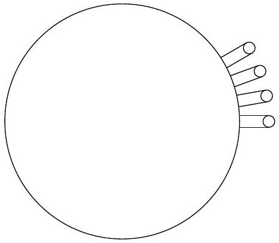

## Problem A1: Shake It

Most hairy mammals shake after getting wet; shaking the water off is energetically advantageous to waiting for it to dry on its own. In this problem, we investigate the mechanics of shaking off water. For simplicity, we will model animals as solid cylinders with the sides covered in fur. You may ignore gravity throughout the problem.

a. We can model the shaking by assuming that the angular position of the cylinder undergoes a sinusoidal oscillation: $\theta=A \cos (\omega t)$. (The rotation is about the axis of rotational symmetry.) Letting the radius of the cylindrical animal be $R$, derive an expression for the magnitude of the acceleration of a point on the surface of the animal under such a motion.
b. For the rest of this problem, rather than modeling sinusoidal motion, we will assume that the cylindrical animal is simply spinning at constant angular speed $\omega$. Wet fur tends to separate into cylindrical clumps of radius $r \ll R$. A droplet of water on the end of a clump of fur will be separated from it if the centripetal force overcomes the forces due to surface tension. Derive an approximate relationship (valid up to scalar numerical constants) between the surface tension $\sigma$, the radius $r$ of the fur clump, the radius $R$ of the animal, the angular speed $\omega$, and the density $\rho$ of water. The diagram below show the cross-section of the animal, showing four clumps of fur with droplets on their end.

c. Experimentally, it is observed that all mammalian fur forms clumps of similar radius. Under the assumption that different animals all have the same density and are simply scaled copies of each other (i.e. larger animals are both longer and fatter), the relationship between an animal's mass $M$ and its angular velocity of shaking $\omega$ is of the form $\omega \sim M^{n}$ : find the value of $n$.
d. Shaking requires energy, which we can crudely model as the rotational energy of the corresponding cylinder. An alternative strategy for the animal is to simply air-dry their fur, which requires energy to evaporate the water. Assume a wet animal has approximately 5\% of their body weight in water, and has to supply all the energy for evaporating the water. Our model predicts that for some animal sizes, it will be energetically advantageous to air dry themselves: estimate the range of animal masses for which this is true. You may use the following facts: a mouse weighs 20 g , has a radius of 1 cm , and shakes itself with angular velocity $\omega=30 \mathrm{rad} / \mathrm{s}$. The latent heat of vaporization of water at room temperature is $\lambda=2430 \mathrm{~J} / \mathrm{g}$.
