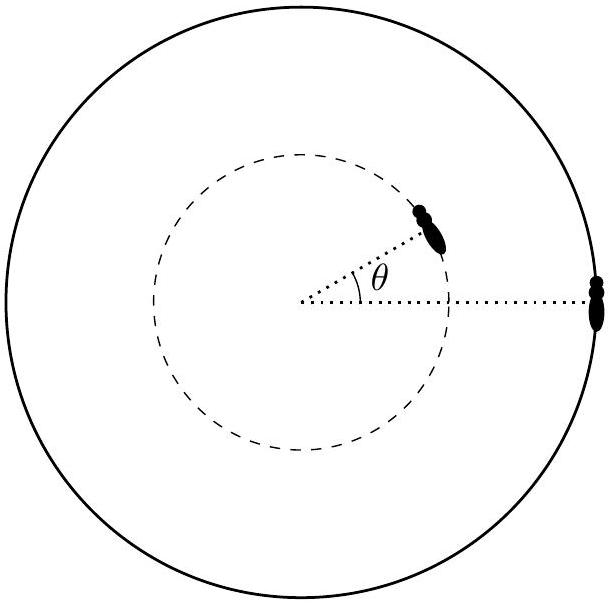

## Problem B1: Scroll 'n' Roll

Consider a disk with mass $m$ and radius $R$ placed on a large and frictionless table. An ant with mass $m$ is placed on top of the disk. The ant can move freely without sliding on the disk.

a. Initially, the ant starts on the edge of the disk, and both the ant and the disk are at rest (relative to the table). Then, the ant starts walking across the disk's diameter, such that in the frame of the disk, the ant has (constant) velocity $v$. What is ant's velocity in the frame of the table?
b. Suppose instead that the ant walks counterclockwise along the edge of the disk at constant speed $v$ in the frame of the disk. What is the ant's speed in the frame of the table?
c. Now there are two ants on the disk! The second ant (also of mass $m$ ) starts at distance $R / 2$ from the center of the disk, with an angle offset by $\theta$ from the first ant. The second ant walks counterclockwise around this circle with radius $R / 2$ at speed $v / 2$ (relative to the disk). Find all $\theta$ such that the second ant is stationary in the frame of the table.

