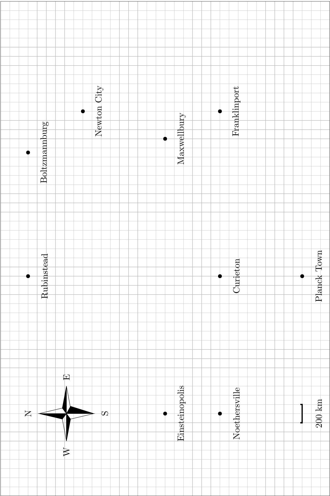

## Question 1

## The Jet Stream

The jet stream is an eastward wind current that moves over the continental United States at an altitude of 23, 000 to 35, 000 feet (the range of typical cruising altitudes of commercial airlines). This strong current affects flight times significantly: flights traveling eastward fly significantly faster than flights traveling westward.

This problem consists of two independent parts. In the first part, you will consider a simple model for airplane flight. In the second part, you will determine the jet stream speed on a fictitious planet called Orb.

1. The power that a plane expends is used both to combat drag and to generate lift. Throughout this part of the problem, you may assume that the plane travels with horizontal velocity $\mathbf{v}_{\text {rel }}$ relative to the air, the density of air is $\rho_{\text {air }}$, the mass of the plane is $m$, and the cross-sectional area of the plane is $A_{\mathrm{cs}}$.
    (a) The drag force on an airplane is given by
$$
\mathbf{F}_{\mathrm{drag}}=-\frac{1}{2} c_{d} \rho_{\mathrm{air}} A_{\mathrm{cs}}\left|\mathbf{v}_{\mathrm{rel}}\right| \mathbf{v}_{\mathrm{rel}},
$$
where $c_{d}$ is the drag coefficient (which depends on the shape of the plane). Write an expression for the power expended by the airplane to combat the drag force from the air.
    (b) Airplanes generate lift by deflecting air downward.
i. Estimate the air mass per unit time which is deflected by the wings of the plain.
ii. Estimate the power expended by the plane for lift.
    (c) Estimate the speed at which an airplane flies relative to the air by minimizing the power expended by the plane. To get a numeric answer, you may use the following parameters:
$$
m_{\text {plane }} \sim 8 \times 10^{4} \mathrm{~kg}, \quad \rho_{\text {air }} \sim 1 \mathrm{~kg} / \mathrm{m}^{3}, \quad c_{d} \sim 10^{-2}, \quad A_{\mathrm{cs}} \sim 100 \mathrm{~m}^{2} .
$$

Next, we estimate the jet stream speed using flight times. Because the jet stream speed on Earth varies greatly with location, time of year, and climate effects (such as El Niño and La Niña), you will instead consider the fictitious planet Orb, where the jet stream is eastward and uniform in the region of interest. At the end of the problem is a map of the region, whose area is much smaller than the surface area of Orb (i.e., you can neglect the curvature of Orb).

2. At cruising altitude, we asume all airplanes travel at a fixed speed $v_{\text {rel }}$ relative to the air. (This is not necessarily the same as your answer to 1(c), which was just a rough estimate.) Additionally, we assume that flights occur in three stages - (1) taxi and takeoff, (2) flight at cruising altitude, (3) landing and taxi - and that stages (1) and (3) take a fixed total time $t_{0}$ for every flight.
    (a) Suppose a plane, at cruising altitude, is traveling at an angle $\theta$ away from due east relative to the ground. What is the speed of the plane relative to the ground? Give your answer in terms of $v_{\text {rel }}, \theta$, and $v_{w}$, the speed of the jet stream relative to the Earth's surface.
    (b) If the plane travels a distance $D$, what is the total travel time $t$, including taxi, takeoff, and landing?

(c) Below, we present some data on airplane flights on Planet Orb. Each of the flight times shown below has an independent uncertainty of $\Delta t=5 \mathrm{~min}$. From the data and the map, determine $v_{w}$ and $v_{\text {rel }}$, giving your answers in km per hour with uncertainties. Indicate clearly what two quantities you are plotting against each other on each graph that you plot.

| Departure City | Arrival City | $t$ (min) |
| :--- | :--- | :--- |
| Noethersville | Rubinstead | 185 |
| Rubinstead | Noethersville | 286 |
| Curieton | Franklinport | 107 |
| Franklinport | Curieton | 244 |
| Planck Town | Maxwellbury | 143 |
| Maxwellbury | Planck Town | 256 |
| Rubinstead | Boltzmannburg | 92 |
| Boltzmannburg | Rubinstead | 190 |
| Einsteinopolis | Maxwellbury | 160 |
| Maxwellbury | Einsteinopolis | 384 |
| Planck Town | Franklinport | 128 |
| Franklinport | Planck Town | 266 |
| Einsteinopolis | Franklinport | 188 |
| Franklinport | Einsteinopolis | 431 |
| Boltzmannburg | Maxwellbury | 135 |
| Maxwellbury | Boltzmannburg | 150 |

| Departure City | Arrival City | $t$ (min) |
| :--- | :--- | :--- |
| Noethersville | Einsteinopolis | 68 |
| Einsteinopolis | Noethersville | 74 |
| Franklinport | Newton City | 144 |
| Newton City | Franklinport | 129 |
| Curieton | Rubinstead | 186 |
| Rubinstead | Curieton | 175 |
| Planck Town | Curieton | 95 |
| Curieton | Planck Town | 102 |
| Planck Town | Rubinstead | 249 |
| Rubinstead | Planck Town | 250 |

