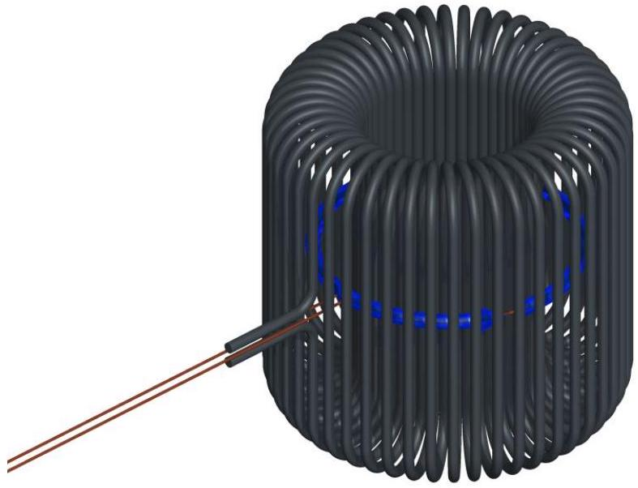

## Question 2

## The Dark Forest

Dark matter could be made of hypothetical, extremely light particles called axions. Because individual axions are so light, experiments do not search for individual axions, but rather for the classical axion field formed by a large collection of axions, which oscillates as

$$
a(t)=a_{0} \sin (\omega t) .
$$

This is analogous to how a large collection of photons can form a classical electromagnetic field. In the presence of a magnetic field B and an axion field $a$, the axion field produces an effective current

$$
\mathbf{J}=g \dot{a} \mathbf{B}
$$

where we define $\dot{a}=d a / d t$. The effective current produces electromagnetic fields in exactly the same way as ordinary current, though it does not come from the motion of actual charges. Experiments can search for axion dark matter using systems which are resonantly driven by this current.

You may use fundamental constants in your answers, such as

$$
\begin{array}{rlrl}
c & =3.00 \times 10^{8} \mathrm{~m} / \mathrm{s} & \hbar & =1.055 \times 10^{-34} \mathrm{~J} \cdot \mathrm{~s} \\
G & =6.67 \times 10^{-11} \mathrm{~N} \cdot \mathrm{~m}^{2} / \mathrm{kg}^{2} & \mu_{0} & =4 \pi \times 10^{-7} \mathrm{~N} / \mathrm{A}^{2} \\
& k_{B} & =1.602 \times 10^{-19} \mathrm{C} \\
\end{array}
$$

You do not have to provide numeric answers unless asked. When asked to "estimate", you may drop constants of order one. The numeric values provided below are from standard references where $\hbar$, $c, \mu_{0}$, and $\epsilon_{0}$ are set to one; to get correct numeric results, you must restore these factors yourself.

1. First, we will describe some physical properties of the axion field.
(a) Consider a single axion at rest, with mass $m$. Find its associated angular frequency $\omega$. This will be the angular frequency of the corresponding classical field, when there are many axions.
(b) Suppose dark matter is distributed spherically symmetrically in the galaxy with uniform density $\rho$. The solar system is a distance $r$ from the center of the galaxy and orbits around it with period $T$. Neglecting everything besides dark matter, find the dark matter density $\rho$.
(c) The energy density of the axion field is $m^{2} a_{0}^{2} /\left(2 \hbar^{3} c\right)$. Find the axion field amplitude $a_{0}$.
(d) The radius and period of the Sun's orbit, as well as a typical axion mass, are
$$
r=2.5 \times 10^{20} \mathrm{~m}, \quad T=7.1 \times 10^{15} \mathrm{~s}, \quad m=1.0 \times 10^{-9} \mathrm{eV} .
$$
Numerically compute the axion field amplitude $a_{0}$.
(e) In this problem, we treat the axion field as spatially uniform within a terrestrial laboratory. To verify that this assumption is reasonable, numerically estimate the axion field's wavelength $\lambda$, assuming the axions have the same galactic speed as the Sun.
(f) In part (a), you found $\omega$ by neglecting the axion's speed. In reality, the axion's finite speed changes the frequency to $\omega+\Delta \omega$, in a frame at rest with respect to the galactic center. Numerically estimate $\Delta \omega / \omega$ to show that it is reasonable to neglect this effect.

The ABRACADABRA ${ }^{1}$ experiment, currently taking data at MIT, is a toroidal solenoid with inner and outer radius $R_{\text {in }}$ and $R_{\text {out }}$ and height $h$. You may assume $h \gg R_{\text {out }}$ for simplicity. A superconducting wire carrying current $I$ wraps $N$ times around the toroid, where $N$ is high enough to neglect the discreteness of the wires. A circular pickup loop with radius slightly less than $R_{\text {in }}$ is placed at the center of the toroid.
2. Now, we will find the axion signal generated in the ABRACADABRA apparatus.

(a) Find the magnetic field $\mathbf{B}(\mathbf{r})$ inside the toroid due to the superconducting current.
(b) The superconducting wires lose their superconductivity when exposed to a magnetic field greater than $B_{\text {max }}$. Find the maximum possible current $I_{\text {max }}$ that can be used, and assume this current is used in later parts.
(c) Assuming that $\omega$ is small, find the magnetic flux $\Phi_{B}(t)$ through the pickup loop due to the axion field in terms of $a_{0}, g, \omega, B_{\text {max }}$, and the dimensions of the apparatus. (You may ignore any currents induced on the surfaces of the superconducting wires. Accounting for them makes the problem much harder, but does not substantially affect the final result.)
(d) If $\omega$ is too large, the result above breaks down due to radiation effects. Estimate the frequency $\omega_{c}$ where this happens.
(e) Using the design values
$$
R_{\text {in }}=0.5 \mathrm{~m}, \quad R_{\text {out }}=1.0 \mathrm{~m}, \quad h=2.0 \mathrm{~m}
$$
estimate the numerical value of $\omega / \omega_{c}$.
(f) Let $\Phi_{0}$ be the amplitude of the time-varying axion flux. Using the typical values
$$
B_{\max }=5.0 \mathrm{~T}, \quad g=1.0 \times 10^{-16} \mathrm{GeV}^{-1}
$$
and your previous results, compute the numerical value of $\Phi_{0}$.
[^0]The pickup loop has inductance $L$ and is attached to a capacitor, forming a circuit with resonant frequency equal to the axion frequency $\omega$. The circuit also has a small internal resistance $R$ in series, and is at temperature $T$. The axion signal can be detected by monitoring the current in the circuit. The main source of noise is thermal noise, which causes fluctuations in the current.
3. We will now estimate the sensitivity of ABRACADABRA to axions.

(a) The axion produces a current which oscillates sinusoidally. Find the signal current amplitude $I_{s}$ in terms of $\omega, \Phi_{0}$, and the circuit parameters.
(b) Find the average value of the current squared $\left\langle I^{2}\right\rangle$ in the circuit due to thermal noise.
(c) At any moment in time, the noise current is oscillating sinusoidally with typical amplitude $I_{n}=\sqrt{\left\langle I^{2}\right\rangle}$, which is much larger than $I_{s}$. However, the phase of the noise current also fluctuates randomly, so that after a typical time $t_{c}$, its phase will be roughly independent of the phase it had before. Find an estimate for $t_{c}$ in terms of $\omega$ and the circuit parameters. (Hint: at any given moment, the thermal noise current is simultaneously being produced by the random motion of electrons in the circuit, and damped by the resistor.)
(d) Suppose the experiment runs for a total time $t_{e} \gg t_{c}$. Roughly estimate the average amplitude of the noise current over this period of time.
(e) The axion is detectable if the signal current amplitude is larger than the averaged noise current amplitude, and the circuit parameters are
$$
L=1 \mathrm{mH}, \quad R=10 \mathrm{~m} \Omega, \quad T=0.1 \mathrm{~K} .
$$
Roughly numerically estimate the time needed to potentially detect the axion. (Hint: if your answer seems strange, note that in reality, the axion's phase also fluctuates over time, because of the effect of part 1(f). In addition, we don't know $\omega$ ahead of time, so the experiment needs to be run many times. We ignored these effects here to keep things simple.)
