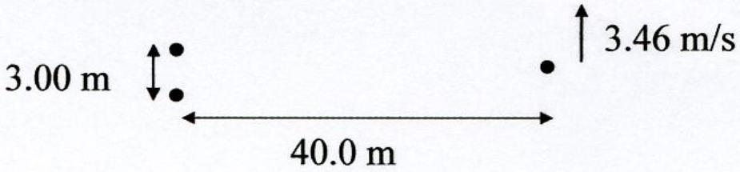

3. Two speakers are 3.00 m apart. They both emit perfect sinusoids, whose frequencies differ by 0.250 Hz. Spaceman Fred, who is standing 40.0 m away in the direction shown in the diagram, must run at 3.46 m/s to avoid hearing beats. The speed of sound in air is 343 m/s. Approximately what frequency are the speakers emitting?

