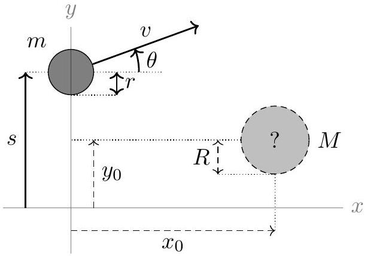

### 4.2 Collision with Disk

In this part, you will launch a "probe" disk towards a hidden, second disk on the table, which begins at rest with its center at an unknown position $\left(x_{0}, y_{0}\right)$ (where $x_{0}>0$ ), with mass $M$ and radius $R$. The probe disk has radius $r=(0.250 \pm 0.001) \mathrm{m}$, but you may choose its mass $m$, initial position $(0, s)$, initial speed $v$, and the initial direction $\theta$ of its velocity (as an angle relative to the horizontal). Both disks are frictionless, so that rotation is irrelevant. The program will simulate the collision, if it occurs, and return the final velocity (speed and angle) of the probe disk.

The parameters you choose must be in the following ranges:

- $1 \mathrm{~kg} \leq m \leq 5 \mathrm{~kg}$.
- $-2 \mathrm{~m} \leq s \leq 2 \mathrm{~m}$.
- $0.5 \mathrm{~m} / \mathrm{s} \leq v \leq 10.0 \mathrm{~m} / \mathrm{s}$.
- $-90^{\circ} \leq \theta \leq 90^{\circ}$.

The parameters you specify are affected by the following uncertainties:

- m: relative $1 \%$, plus absolute 0.05 kg .
- $s$ : absolute 2 mm.
- $v$ : relative $1 \%$, plus absolute 0.05 m/s.
- $\theta$ : absolute $0.1^{\circ}$.
