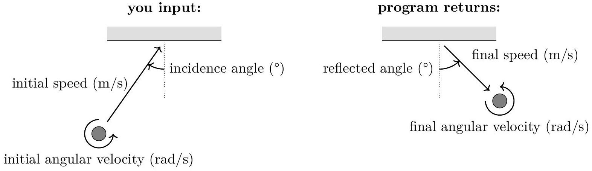

### 4.1 Collision with Wall

In this part, you will launch a disk with mass $M$, radius $R$ and moment of inertia $I=\beta M R^{2}$ towards a fixed, long vertical wall. You specify the initial speed and counter-clockwise angular velocity of the disk, and the angle of its initial velocity incident to the normal of the wall. The program will simulate the collision and return the final values of these parameters after collision.

The parameters you specify must be in the following ranges:

- $0.5 \mathrm{~m} / \mathrm{s} \leq$ initial speed $\leq 10 \mathrm{~m} / \mathrm{s}$.
- -50 rad/s $\leq$ initial angular velocity $\leq 50 \mathrm{rad} / \mathrm{s}$.
- 0° $\leq$ incidence angle $\leq 75^{\circ}$.

To simulate imperfections in the disk-firing mechanism, the initial values you specify are always affected by the following uncertainties:

- Initial speed: relative uncertainty 5 \%, compounded with absolute uncertainty 0.05 m/s.
- Initial angular velocity: relative uncertainty $5 \%$, compounded with absolute uncertainty $0.2 \mathrm{rad} / \mathrm{s}$.
- Incidence angle: absolute uncertainty 1°.
