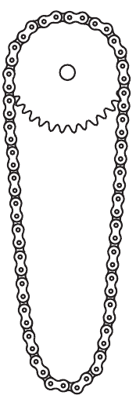

**Problem 1. Gear wheel and bicycle chain**

We fix a gear wheel's axis horizontally and place a bicycle chain on it as shown in figure $1/a)$, then slowly begin to rotate the gear about its axis. What shape does the chain take when the gear is already rotating rapidly at constant angular velocity?

Marci thinks that the chain's shape and position remain the same as before; the only change is that the chain links spin around along the original shape. Karcsi doesn't believe this; he thinks that due to rotation, the chain becomes rounded and approximately circular as shown in figure $1/b)$. Who is right, Marci or Karcsi? (Prove one of the statements, or at least show that the other statement cannot be true!)

(Vigh Máté)
