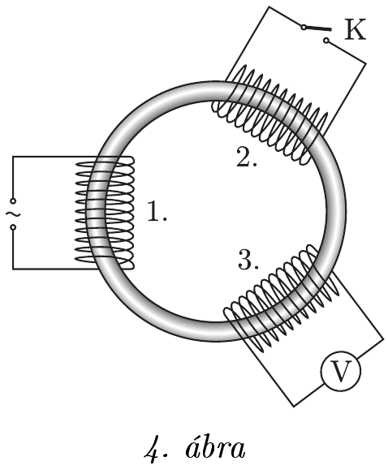

**Problem 3. Toroid Transformer**

A "thin" toroidal magnetic core has three identical "fat" electromagnetic coils symmetrically wound on it, as shown in Figure 4. An AC voltage source is connected to the first coil, the terminals of the second coil are left open, and a voltmeter is connected across the third coil. In this configuration, the voltmeter reads half the effective value of the voltage source.

Next, we short-circuit the terminals of the second coil using switch K. What does the voltmeter read in this case?

**Hint:** The ohmic resistance of the coils is negligible, the voltage source and voltmeter can be considered ideal. The magnetic permeability of the core is independent of the magnetic flux.

(Honyek Gyula)
