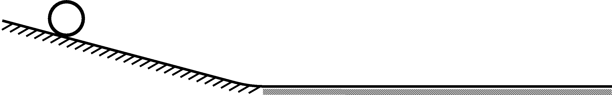

**1. Rolling cylinders.**

Two relatively long rigid bodies have equal masses and equal external dimensions.
One is a solid right circular cylinder made of aluminium, and the other is a tube
made of copper with uniform wall thickness. The bodies are placed on a hard, rough
incline with their axes horizontal.

**a)** From what height should each body be released so that it reaches the bottom of
the incline with a translational speed of $1\ \mathrm{m/s}$?

After leaving the incline at $1\ \mathrm{m/s}$, the bodies continue rolling while
slowing down on a soft, long horizontal surface. They are braked because the surface
is slightly indented by the bodies. Assume that the instantaneous point of
application of the resultant force exerted by the horizontal surface is at the same
location on the cylindrical surface in both cases.

**b)** The aluminium cylinder stops after travelling $2\ \mathrm{m}$ on the
horizontal surface. Where does the copper tube stop?

Data: the density of aluminium is $2.7\ \mathrm{g/cm^3}$ and the density of copper is
$8.9\ \mathrm{g/cm^3}$.
