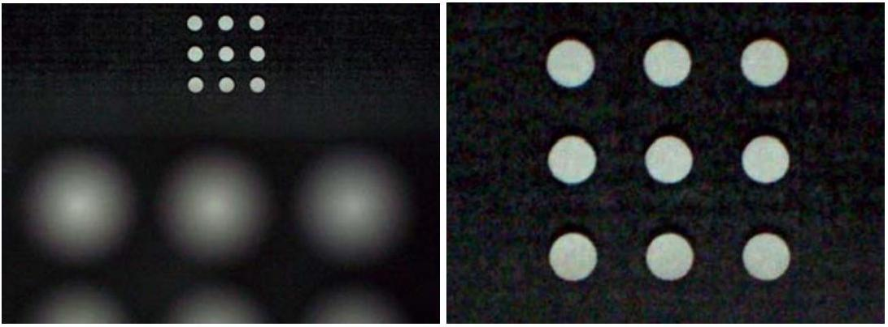

**P2. Camera lens depth of field**

Two identical black sheets each have nine small white dots. The distance between the centers of adjacent dots is 5.8 mm. We took photographs of the sheets with a camera: the camera produced a sharp image of the farther sheet, which is at a distance of 25 cm from the lens, while the image of the closer sheet was blurred. The left image shows the complete photograph, and the right image shows an enlarged detail of the top of the photograph. The focal length of the camera lens is 18 mm.

Estimate from the given data and measurements from the photographs the distance of the closer sheet from the lens, as well as the diameter of the camera lens.

