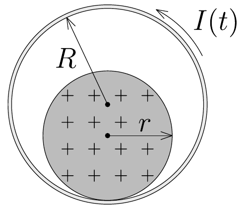

**3. Problem. Charged Cylinder in a Solenoid**

A long solenoid has a fixed, horizontal axis, with a circular cross-section of radius $R$. Inside the solenoid is a solid cylinder of radius $r$ made of (non-magnetic) insulating material. The insulating cylinder is positively charged, with a uniform volume distribution. A current of rapidly increasing strength is applied to the solenoid uniformly over time, in the direction shown in the figure.

In what direction does the insulating cylinder start rolling? How does the response depend on the ratio $r/R$? At what ratio $r/R$ will the charged cylinder remain at rest?

Static friction is sufficiently large to prevent the cylinder from slipping. Ignore rolling resistance.
