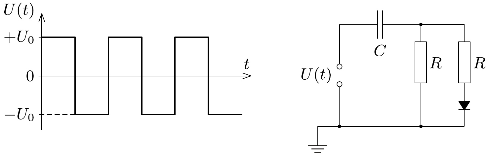

**P3. Diode-Capacitor Rectification Circuit**

A circuit is constructed from an ideal diode, two resistors of $R=2 \mathrm{~k}\Omega$, an initially uncharged capacitor of $C=100 \mu \mathrm{F}$, and a voltage generator as shown in the diagram. A symmetric square wave is applied to the voltage generator with frequency $f=5 \mathrm{kHz}$, varying between $+U_0$ and $-U_0$, where $U_0=3.6 \mathrm{~V}$.

a) What is the maximum voltage to which the capacitor charges?
b) Approximately how much time elapses from the initial uncharged state until the capacitor voltage reaches half of its maximum value?

