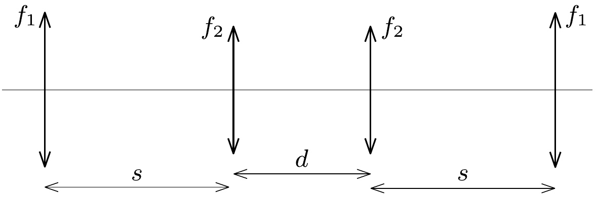

**2. Rotating Aluminum Tube in a Magnetic Field in Weightlessness.**

In a state of weightlessness, an aluminum tube of radius $R$, length $L \gg R$, and wall thickness $d \ll R$ is placed in a uniform magnetic field of induction $B$ perpendicular to its axis of symmetry. We rotate the tube about its axis with angular velocity $\omega_{0}$ and then leave it alone.

a) Sketch the current streamlines that develop in the tube on a diagram of the tube's unrolled surface!

b) Describe the tube's motion as a function of time!

