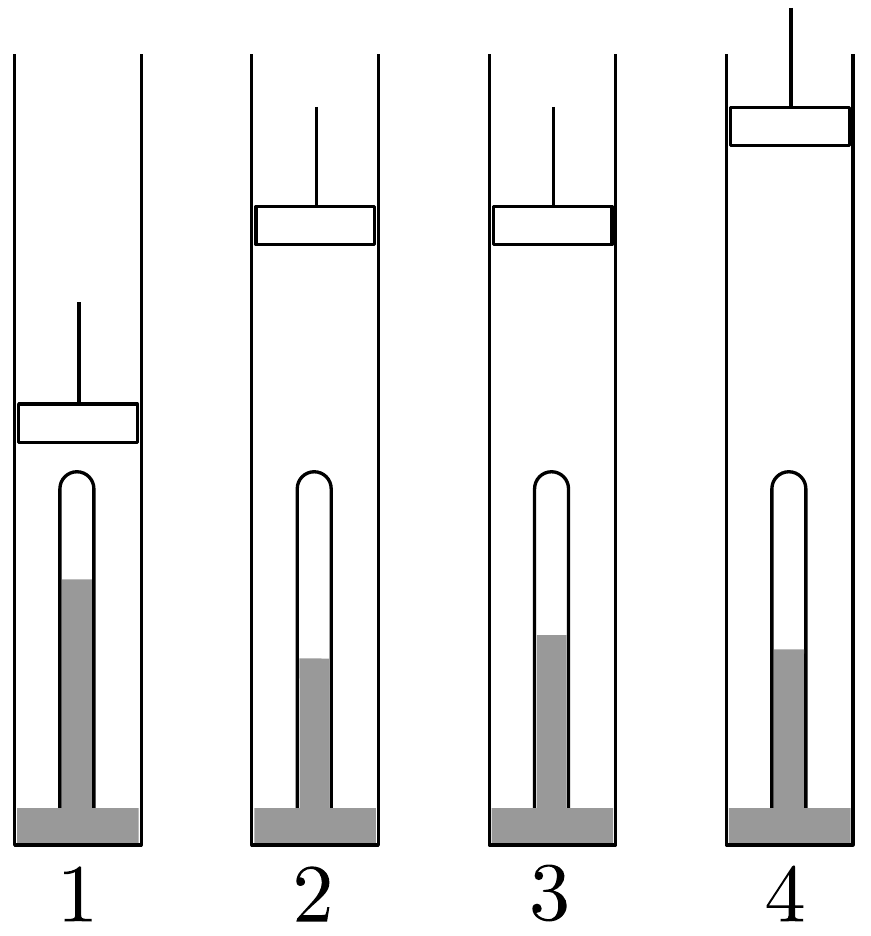

## Feladat 2

Dugattyús hengerben a 20. ábrán látható Torricelli-kísérletet állítjuk össze. A higany fölött hidrogén, a hengerben levegő van. Az 1. állapotban a

higanyoszlop magassága 70 cm , a levegő nyomása $p_{1}=1,334 \cdot 10^{5} \mathrm{~Pa}=100 \mathrm{Hgcm}$, a hőmérséklet 273 K. A dugattyút állandó hőmérséklet mellett lassan felhúzva a levegő nyomása a 2. állapotban $p_{2}=0,8 \cdot 10^{5} \mathrm{~Pa}=60 \mathrm{Hgcm}$ lesz és a higanyszint 40 cm. Ezután a dugattyú változatlan helyzete mellett a hómérsékletet $T_{3}$-ra emeljük; ebben a 3. állapotban a higanyoszlop magassága 50 cm. Végül úgy jutunk a 4. állapothoz, hogy a levegő nyomása változatlan marad, de a higanyszál
magassága 45 cm lesz. Mennyi a hidrogéngáz nyomása és hőmérséklete a végső állapotban?
