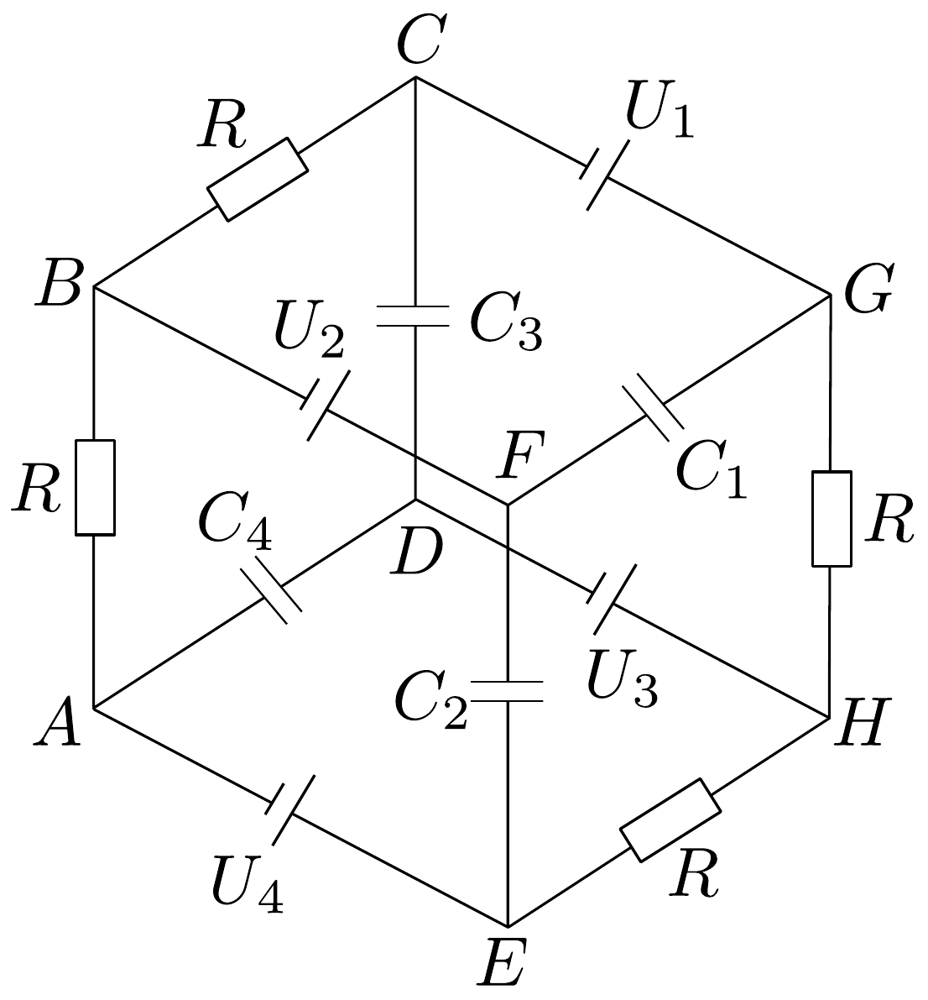

## Feladat 3

A 21. ábra szerinti kapcsolásban $R$ négy darab egyenlő ellenállást, $C_{1}, C_{2}, C_{3}, C_{4}$ négy darab egyenlő, $1 \mu \mathrm{~F}$-os kondenzátort jelent. A négy áramforrás feszültségei $U_{1}=4 \mathrm{~V}, U_{2}=8 \mathrm{~V}, U_{3}=12 \mathrm{~V}$ és $U_{4}=16 \mathrm{~V}$; belsó ellenállásuk elhanyagolható. Mennyi a négy kondenzátor összes energiája? Mennyi a $C_{2}$ kondenzátor töltése, ha a $H$ és $B$ pontokat rövidre zárjuk?

