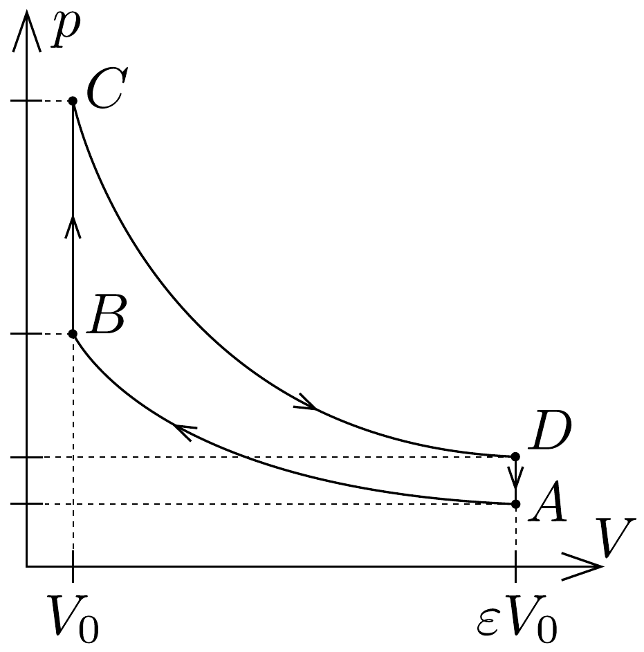

## Feladat 1

Egy négyütemú motor kompresszióviszonya (a henger legnagyobb és legkisebb térfogatának az aránya) $\varepsilon=9,5$. A motor 27 °C hőmérsékletú, $\varepsilon V_{0}$ térfogatú levegőt és benzingőzt szív be 100 kPa nyomáson. Ezután súrítés következik, az 53, ábrán az $A$ pontból a $B$ pontba adiabatikusan jutunk el $(\kappa=1,4)$. A robbanáskor $(B \rightarrow C)$ a nyomás megkétszereződik. A dugattyú kilökése közben $(C \rightarrow D)$ a gázkeverék adiabatikusan terjed ki $\varepsilon V_{0}$ térfogatra. A kipufogószelep kinyílásakor a nyomás visszaesik a kezdeti 100 kPa értékre.

a) Határozzuk meg a nyomás és hómérséklet értékeit az $A, B, C$ és $D$ állapotokban!
b) Mennyi a körfolyamat elméleti hatásfoka?
