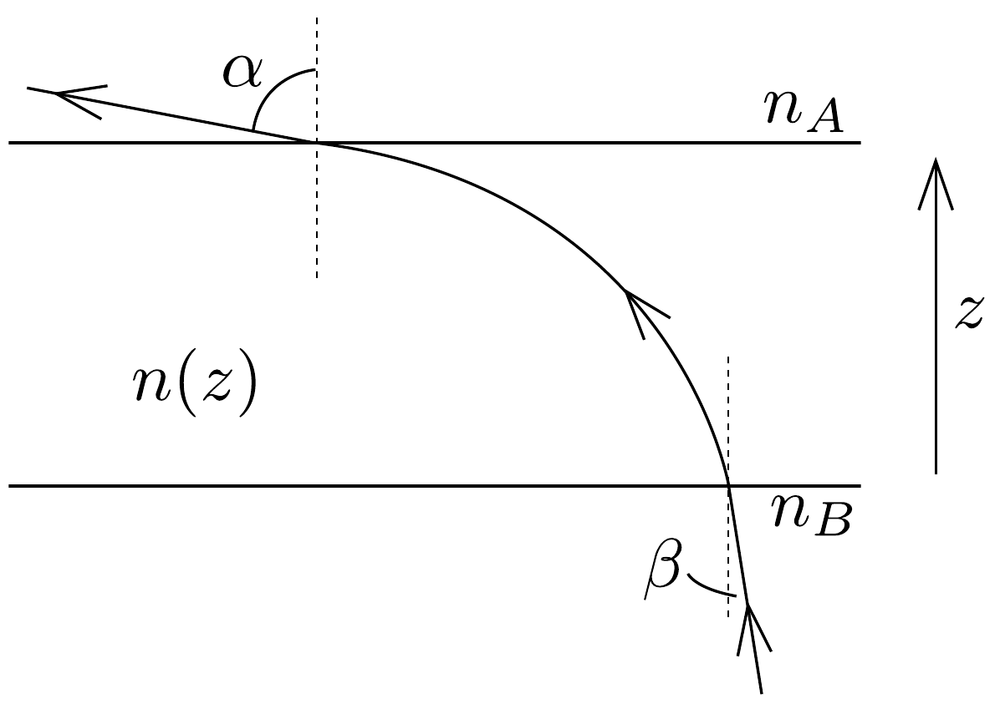

## Feladat 1

a) Tekintsünk a 81. ábrán látható, átlátszó plánparalel lemezt. A lemez anyagának $n$ törésmutatója az alsó laptól mért függőleges $z$ távolság függvényében változik. A lemez tetjén, kívül a törésmutató $n_{A}$, az alján, szintén kívül $n_{B}$. Mutassuk meg, hogy $n_{A} \sin \alpha=n_{B} \sin \beta$ !

b) Tegyük fel, hogy egy nagy sík sivatagban állunk. Ekkor azt látjuk, mintha tőlünk bizonyos távolságra vízfelszín lenne. Ha közeledünk a „vízhez", úgy túnik, mintha az hátrébb menne oly módon, hogy a köztünk és a „víz" közötti távolság állandó marad. Magyarázzuk meg a jelenséget!
c) Határozzuk meg, hogy a b) feladatban leírt jelenségnél mekkora a levegő hőmérséklete közvetlenül a talajnál! Tegyük fel, hogy a szemünk 1,6 m magasan van a talaj felett, és a távolság köztünk és a „víz" széle között 250 m. A levegő törésmutatója 15 °C-on, normál légnyomás mellett 1,000276. Tegyük fel, hogy a levegő hőmérséklete a talajtól mért 1 m magasság felett mindenhol 30 °C. A légnyomás egyenló a normál légnyomással. Tegyük fel, hogy $n-1$ arányos a levegő súrúségével, ahol $n$ a törésmutató. Vizsgáljuk meg az eredmény pontosságát!
