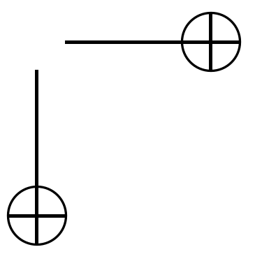
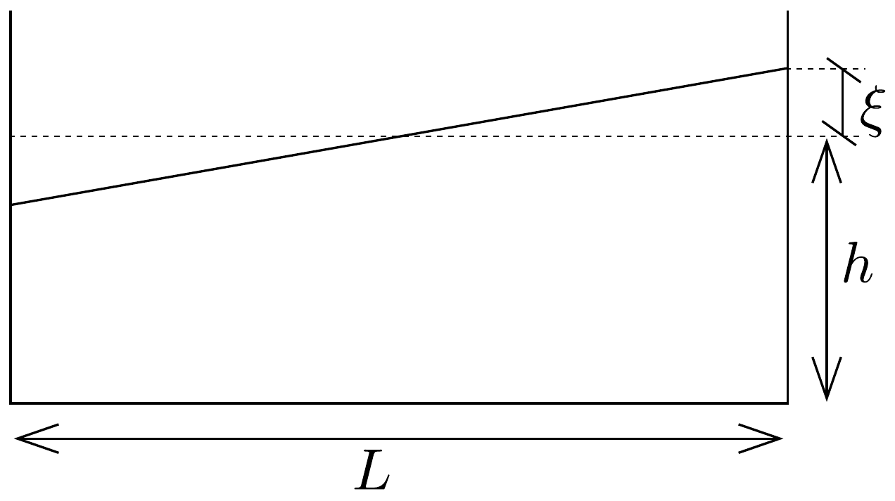

## Feladat 2

Egyes tavaknál időnként a vízszint periodikus változását figyelhetjük meg. Ezt a furcsa jelenséget tólengésnek (seiching) nevezzük, ami általában olyan tavak esetén fordul elő, amelyek mélységükhöz viszonyítva hosszúak és keskenyek. Egy tavon gyakran látunk hullámokat, azonban viszonylag ritkán fordul eló a fenti jelenség, amelynek során az egész víztömeg együtt oszcillál, hasonlóan, mint a kávé a csészében, amikor egy vendégnek visszük.

A jelenség modellezéséhez tekintsünk egy téglatest alakú edényt (82. ábra). Az edény hossza $L$, a vízmélység $h$. Tegyük fel, hogy a vízszint kezdetben kis szöggel dől a vízszinteshez képest. Ezután a víz „billegni” kezd, és feltesszük, hogy

a víz felszíne állandóan sík, azonban oszcillál egy, az edény hosszának felénél lévő vízszintes egyenes körül.

Dolgozzunk ki egy modellt a víz mozgására és adjunk meg egy kifejezést az oszcilláció $T$ periódusidejére! A kezdeti állapot a 82. ábrán látható. Tegyük fel, hogy $\xi \ll h$.

A következő táblázat a periódusidőt adja meg a vízmélység függvényében két különböző hosszúságú edény esetén. Ellenőrizzük, hogy mennyire jól írja le az előbb meghatározott összefüggés a mért adatokat! Mennyire jól használható a modell?

\begin{tabular}[t]{|l|l|}
\hline \multicolumn{2}{|c|}{$L=479 \mathrm{~mm}$} \\
\hline $h(\mathrm{~mm})$ & $T(\mathrm{~s})$ \\
\hline 30 & 1,78 \\
\hline 50 & 1,40 \\
\hline 69 & 1,18 \\
\hline 88 & 1,08 \\
\hline 107 & 1,00 \\
\hline 124 & 0,91 \\
\hline 142 & 0,82 \\
\hline
\end{tabular}

\begin{tabular}[t]{|l|l|}
\hline \multicolumn{2}{|c|}{$L=143 \mathrm{~mm}$} \\
\hline $h(\mathrm{~mm})$ & $T(\mathrm{~s})$ \\
\hline 31 & 0,52 \\
\hline 38 & 0,48 \\
\hline 58 & 0,43 \\
\hline 67 & 0,35 \\
\hline 124 & 0,28 \\
\hline
\end{tabular}

A 83. ábra a svédországi Vättern-tó vízszintváltozását mutatja Bastedalennél (a tó északi végénél, felső grafikon) és Jönköpingnél (déli végénél, alsó grafikon). Ez a tó 123 km hosszú és az átlagos vízmélység 50 m. Mekkora a mérés időskálája?
