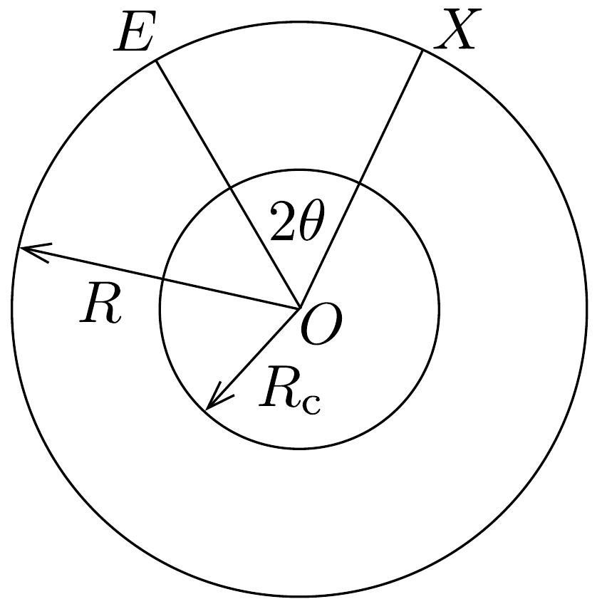

## Feladat 2

Századunk elején a Földről olyan modellt alkottak, amelyben a Földet $R$ sugarú gömbnek tekintették, amely a felszíntől lefelé egészen egy $R_{\mathrm{c}}$ sugárig homogén, izotróp (egynemú) szilárd köpenyből áll. Az $R_{\mathrm{c}}$ sugáron belüli mag tartománya pedig folyadékot tartalmaz.

A longitudinális P és a transzverzális S szeizmikus hullámok sebessége $v_{\mathrm{P}}$ és $v_{\mathrm{S}}$ (a köpenyen belül állandó értékúek). A magban a longitudinális hullámok $v_{\mathrm{cP}}<v_{\mathrm{P}}$ sebességúek, míg transzverzális hullámok a magban nem terjedhetnek.

Egy földrengés a96, ábrán látható földfelszín $E$ jelü pontjában szeizmikus hullámokat kelt, amelyek áthaladnak a Földön, és ezeket egy felszínen levő megfigyelő észleli. A megfigyeló a szeizmométerét a Föld felszínének bármely $X$ pontjában

elhelyezheti. Az $E$ és az $X$ pontok egymáshoz képesti helyzetét (szögeltérését) a $2 \theta$ szög jellemzi:
\[
2 \theta=E O X \varangle,
\]
ahol $O$ a Föld középpontja.
a) Mutassuk meg, hogy azok a szeizmikus hullámok, amelyek egyenes vonalban haladnak át a köpenyen, a földrengés után olyan $t$ „terjedési idővel” később érkeznek meg $X$-be, amelyet az alábbi összefüggés ad meg:
\[
t=\frac{2 R \sin \theta}{v}, \quad \text { amennyiben } \theta \leq \arccos \left(\frac{R_{\mathrm{c}}}{R}\right),
\]
ahol $v=v_{\mathrm{P}}$ a P hullámokra és $v=v_{\mathrm{S}}$ az S hullámokra!
b) Az $X$ pont olyan elhelyezkedése esetén, amelyre $\theta>\arccos \left(R_{\mathrm{c}} / R\right)$, a P szeizmikus hullámok a köpeny-mag felületen történő kétszeres törés után érkeznek meg a megfigyelőhöz. Rajzoljuk le egy ilyen P típusú szeizmikus hullám útját! Vezessünk le összefüggést $\theta$ és $i$ között, ahol $i$ a P szeizmikus hullám beesési szöge a köpenymag felületén!
c) Felhasználva a következő adatokat
\[
\begin{aligned}
R & =6370 \mathrm{~km}, \\
R_{\mathrm{c}} & =3470 \mathrm{~km}, \\
v_{\mathrm{P}} & =10,85 \mathrm{~km} / \mathrm{s}, \\
v_{\mathrm{S}} & =6,31 \mathrm{~km} / \mathrm{s}, \\
v_{\mathrm{cP}} & =9,02 \mathrm{~km} / \mathrm{s},
\end{aligned}
\]
és a $b$ ) alkérdésre kapott eredményt, ábrázoljuk a $\theta$ szöget az $i$ szög függvényében!
Állapítsuk meg, hogy milyen fizikai következményekkel jár ezen függvényalak a földfelszín különböző pontjain állomásozó megfigyelők számára!

Vázoljuk fel a P és az S típusú hullámok esetén a terjedési idő változását a $\theta$ szög függvényében a $0^{\circ} \leq \theta \leq 90^{\circ}$ tartományban!
d) Egy földrengés után egy megfigyelő a P hullám, majd az azt követő S hullám beérkezése között 2 perc 11 másodperc időkülönbséget mér. Határozzuk meg ebből a $c$ ) alkérdésben megadott adatok felhasználásával a földrengés helyének és a megfigyelőnek a szögeltérését!
e) Az előző mérésben a megfigyelő megjegyzi, hogy bizonyos idővel a P és S hullámok beérkezése után még további két alkalommal jelez a szeizmométer. Ezek között az idókülönbség 6 perc 37 másodperc. Magyarázzuk meg az eredményt, és igazoljuk, hogy ez valóban megfelel az előzó alkérdésben kiszámított szögeltérésnek!
