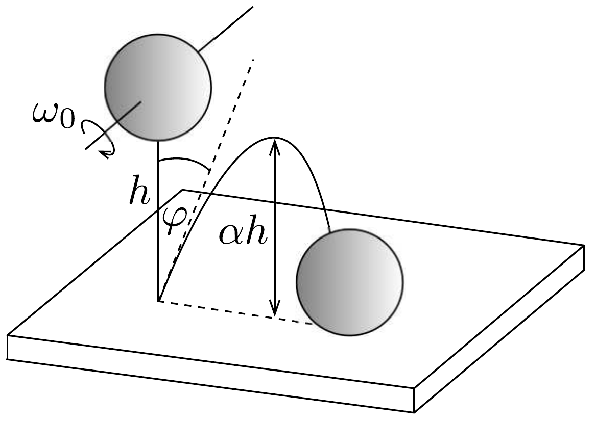

## Feladat 1

A 136. ábrán egy $R$ sugarú, szilárd, homogén golyó látható. Mielőtt leesne a talajra, tömegközéppontja nyugalomban van, azonban a golyó $\omega_{0}$ szögsebességgel forog egy tömegközéppontján átmenő vízszintes tengely körül. A golyó legalsó pontja $h$ magasságban van a talaj felett. Amikor elengedjük, a golyó a gravitáció hatására leesik, és eredeti magasságának adott $\alpha$-szorosára pattan vissza. A golyó és a talaj olyan anyagból vannak, hogy az ütközés során fellépő alakváltozás elhanyagolható. A golyó és a talaj közötti csúszási súrlódási együttható $\mu$. Tegyük fel, hogy az ütközés ideje nagyon kicsi, de véges, és a golyó légüres térben esik. Jelölje $m$ a golyó tömegét, $g$ a gravitációs gyorsulást. A golyó tehetetlenségi nyomatéka a tömegközépponton átmenő tengelyre: $\Theta=2 m R^{2} / 5$.

Először vizsgáljuk azt az esetet, amikor a golyó az ütközés teljes ideje alatt csúszik. Határozzuk meg:
- a) a $\varphi$ visszapattanási szög tangensét;
- b) a tömegközéppont által megtett vízszintes távolságot az első és a második ütközés között;
- c) $\omega_{0}$ legkisebb lehetséges értékét!

Tegyük fel most, hogy a csúszás befejeződik az ütközési időtartam vége előtt.
- d) Válaszoljunk ismét az $a$ ) és $b$ ) kérdésekre!
- $e$ ) Ábrázoljuk vázlatosan $\operatorname{tg} \varphi$ függését $\omega_{0}$-tól a fenti két esetben!
