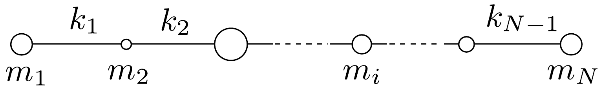
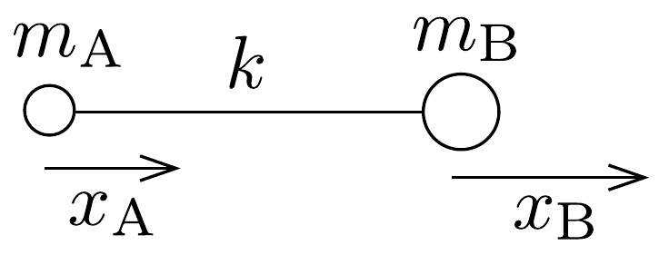
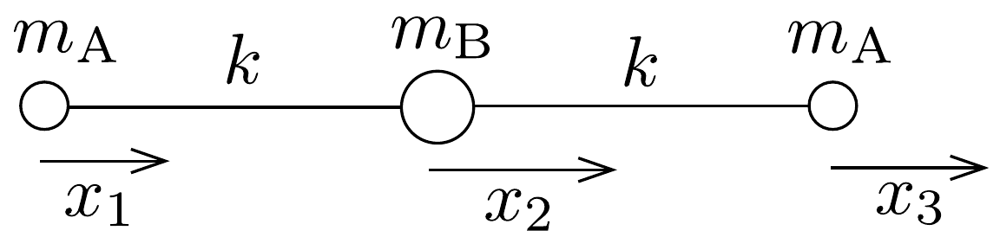

## Feladat 2

Lineáris molekula longitudinális mozgása.
Ebben a feladatban egy lineáris molekula longitudinális, vagyis a molekula tengelyének irányába esó́ mozgását vizsgáljuk. A molekula forgásával, vagy elgörbülésével nem foglalkozunk. A molekula $N$ atomból áll, ezek tömege rendre $m_{1}, m_{2}, \ldots, m_{N}$. Úgy vesszük, hogy mindegyik atom csak a legközelebbi szomszédjához kapcsolódik kémiai kötéssel. Mindegyik kötést tömegnélküli, a Hooketörvénynek eleget tevő rugóval közelítjük. A kötéseknek megfelelő rugóállandók: $k_{1}, k_{2}, \ldots, k_{N-1}$, a 147. ábrának megfelelően.

A megoldáshoz felhasználhatjuk a következőt:
Egy lineáris molekula longitudinális rezgőmozgása egymástól független rezgésekből, úgynevezett normálmódusokból (vagy normálrezgésekből) tevődik össze, szuperponálódik. Az egyes normálmódusokban mindegyik atom azonos frekvenciájú (de különböző amplitúdójú) harmonikus rezgőmozgást végez, és ugyanakkor halad át az egyensúlyi helyzetén.
a) Legyen $x_{i}$ az $i$-edik atom elmozdulása az egyensúlyi helyzetétől. Fejezzük ki az $i$-edik atomra ható $F_{i}$ eredő erőt (minden $i$-re) az $x_{1}, x_{2}, \ldots, x_{N}$ elmozdulások és a kötések $k_{1}, k_{2}, \ldots, k_{N-1}$ rugóállandói függvényében! Milyen összefüggést fedezhetünk fel az $F_{1}, F_{2} \ldots, F_{N}$ erók között? Felhasználva ezt az összefüggést, találjunk kapcsolatot az $x_{1}, x_{2}, \ldots, x_{N}$ elmozdulások között, és adjuk meg ennek fizikai jelentését!
b) Vizsgáljuk meg a 148. ábrán látható kétatomos AB molekula mozgását! A kötés rugóállandója $k$. Adjuk meg az A és a B atomra ható erőket meghatározó kifejezéseket! Határozzuk meg a molekula lehetséges mozgásformáját! Számítsuk

ki a molekula rezgési frekvenciáját, és értelmezzük az eredményt! Hogyan lehetséges az, hogy az atomok ugyanazzal a frekvenciával rezegnek, pedig a tömegük különböző?
c) Tanulmányozzuk a 149 ábrán látható háromatomos $\mathrm{A}_{2} \mathrm{~B}$ molekula mozgását! Fejezzük ki minden egyes atomra a visszatérítő erőt mint csak a szóban forgó atom kitérésének függvényét! Vezessük le a molekula lehetséges mozgásait és a megfelelő rezgési frekvenciákat!

d) $\mathrm{A} \mathrm{CO}_{2}$ molekula két longitudinális rezgési módusának frekvenciája 3,998 ⋅ $10^{13} \mathrm{~Hz}$, illetve $7,042 \cdot 10^{13} \mathrm{~Hz}$. Határozzuk meg a C-O kötés rugóállandóját numerikusan! Mennyire pontosan közelíti a molekulakötés modellje a valódi molekulák rezgőmozgását? A szén relatív atomtömege 12, az oxigéné 16, az atomtömeg egysége pedig $1,660 \cdot 10^{-27} \mathrm{~kg}$.
