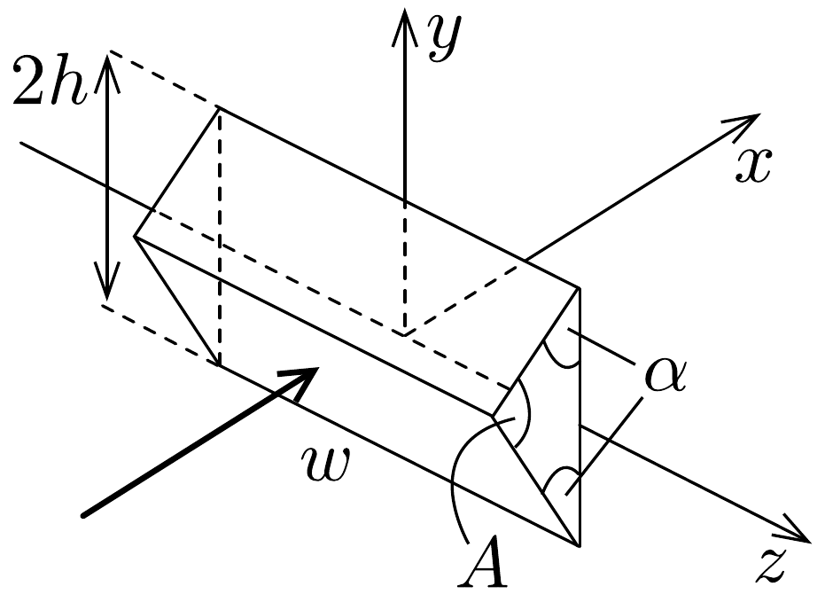
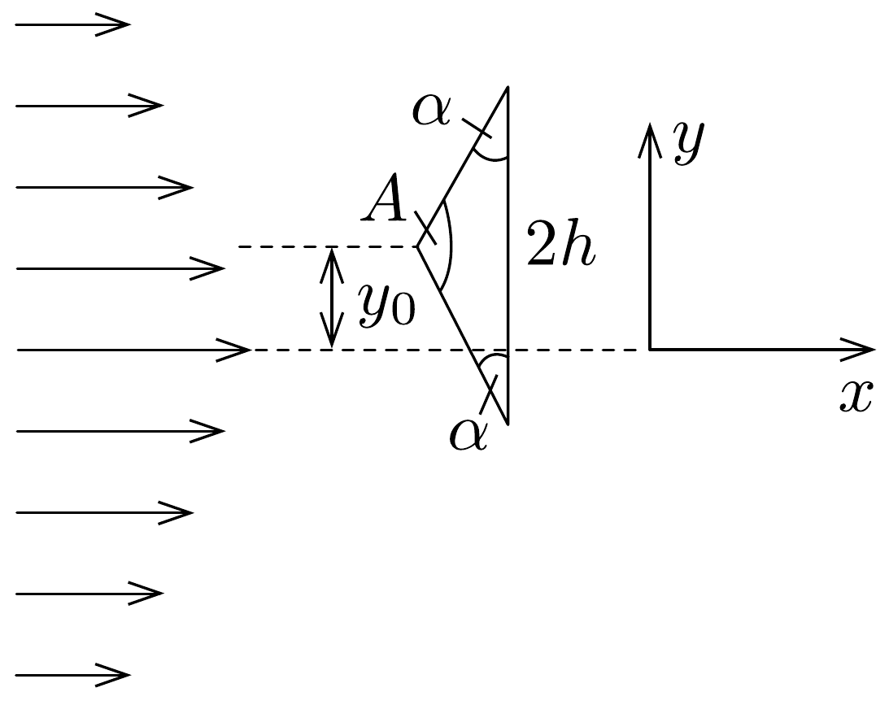
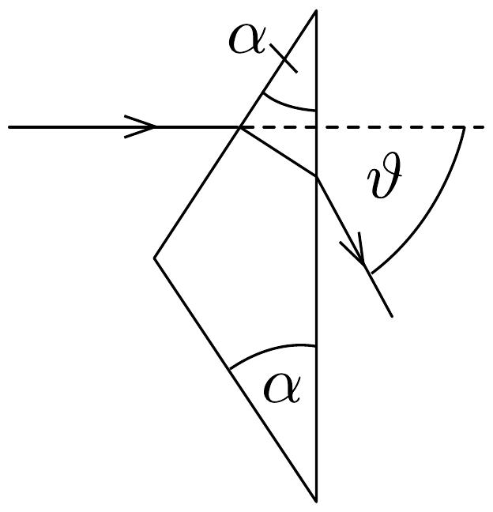

## Feladat 2

Lézerfény erőhatása átlátszó prizmára
A fénytörés következtében egy erős lézersugár számottevő erốt fejthet ki kicsiny, átlátszó testekre. Ennek a jelenségnek a bemutatására tekintsünk egy kicsiny, háromszög alakú üvegprizmát, amelynek csúcsponti szöge $A=\pi-2 \alpha$, alaplapjának hossza $2 h$, szélessége pedig $w$. A prizma törésmutatója $n$, anyagának súrúsége $\varrho$.

Tegyük fel, hogy a prizmát egy olyan lézersugárba helyezzük, amely vízszintesen az $x$ irányban halad. Az egész feladat során feltehetjük, hogy a prizma nem forog, azaz csúcspontja mindvégig a lézersugárral ellentétes irányba mutat, illetve a háromszög alakú oldallapja mindvégig párhuzamos az $x y$ síkkal, és alaplapja mindvégig párhuzamos az $y z$ síkkal, amint ezt a 157. ábra mutatja. A környező levegő törésmutatóját vegyük $n_{\text {lev }}=1$-nek. Tegyük fel továbbá, hogy a prizma oldallapjai visszaveródés elleni bevonattal rendelkeznek, így egyáltalán nem történik visszaverődés.

A lézersugár intenzitása olyan, hogy a $z$-tengely mentén (széltében) egyenletes, azonban az $y$ távolsággal lineárisan csökken az $x$ tengelytől úgy, hogy a maximális $I_{0}$ értékét $y=0$-nál veszi fel, illetve $y= \pm 4 h$ esetén csökken nullára (158. ábra). Az intenzitás az egységnyi felületre esó teljesítményt jelenti, mértékegysége: $\mathrm{W} / \mathrm{m}^{2}$.

a) A lézersugár a prizma felső lapjára esik (159. ábra). Az $x$ tengelyhez képest milyen $\vartheta$ szögben hagyja el az alaplapot ez a sugár? Elegendő egy olyan egyenletet
megadni, amelyben $\alpha$ és $n$ szerepel, és amelyből ki lehet fejezni a $\vartheta$ szöget.

b) Fejezzük ki $I_{0}, \vartheta, h, w$ és $y_{0}$ segítségével a lézersugár által a prizmára ható eredő erő $x$ és $y$ komponensét, ha a prizma csúcsát $y_{0}$ távolsággal eltoljuk az $x$ tengelytől, ahol $\left|y_{0}\right| \leq 3 h$ (158, ábra)! Ábrázoljuk grafikusan az erő vízszintes és függőleges komponensének értékét az $y_{0}$ függőleges eltolódás függvényében!
c) Tegyük fel, hogy a lézersugár 1 mm széles a $z$ irányban, és $80 \mu \mathrm{~m}$ keskeny az $y$ irányban. A prizma adatai: $\alpha=30^{\circ}, h=10 \mu \mathrm{~m}, w=1 \mathrm{~mm}, n=1,5$ és $\varrho=2,5 \mathrm{~g} / \mathrm{cm}^{3}$. Hány watt teljesítményú lézer szükséges ahhoz, hogy ezt a prizmát egyensúlyban tartsa az $y$ irányú gravitációs eróvel szemben, ha a prizma csúcsa $y_{0}=-h / 2 \mathrm{~m}$ távolságra van a lézersugár tengelye alatt?
d) Tegyük fel, hogy ezt a kísérletet gravitációmentes helyen végezzük el ugyanezzel a prizmával, és a lézernyaláb kiterjedése is ugyanakkora, mint az előző alkérdésben, az intenzitásának értéke azonban $I_{0}=10^{8} \mathrm{~W} / \mathrm{m}^{2}$. Mekkora periódusidejú rezgéssel mozogna a prizma, ha $y_{0}=h / 20$ távolságra tennénk a lézersugár közepétől, és ott magára hagynánk a prizmát a gravitációmentes térben?
