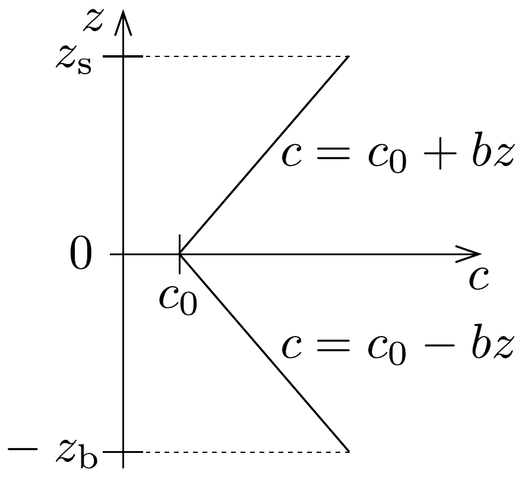
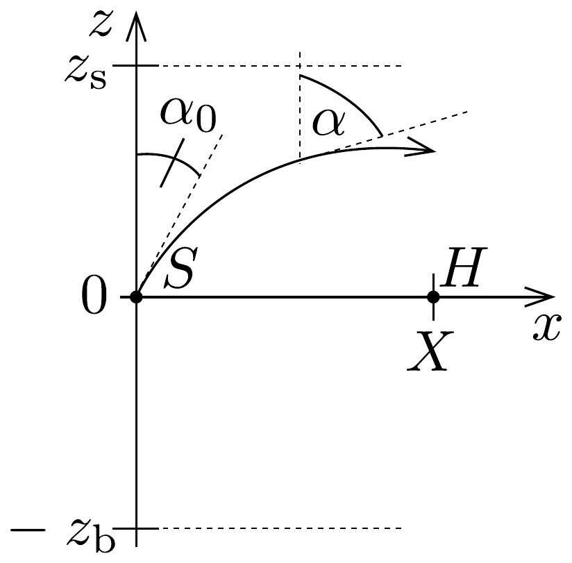

## Feladat 2

Hangterjedés
Az óceánban a hang terjedési sebessége a sótartalom és a hőmérséklet változása miatt függ a mélységtől. A 186. ábra a $c$ hangsebesség változását mutatja a

$z$ mélység függvényében egy olyan helyen, ahol a hangsebesség a vízfelszín és a tengerfenék között félúton minimális, $c_{0}$ nagyságú. Az egyszerúség kedvéért válasszuk ezt a minimumhelyet a $z=0$ szintnek, továbbá $z=z_{\mathrm{s}}$ legyen a vízfelszín, $z=z_{\mathrm{b}}$ pedig a tengerfenék szintje. A $z=0$ szint felett
\[
c=c_{0}+b z,
\]
míg a $z=0$ szint alatt
\[
c=c_{0}-b z .
\]
Mindkét esetben $b$ ugyanaz az állandó.
A 187. ábra a $z-x$ sík egy részletét mutatja az óceánban, ahol $x$ a vízszintes irány. A $z-x$ metszet minden pontjában a $c(z)$ hangsebesség a 186. ábrának megfelelő. A $z=0, x=0$ helyen egy $S$ jelü hangforrást helyeztünk el. A hangforrásból $\alpha_{0}$ kezdőszöggel hangsugár lép ki. Mivel a hangsebesség $z$-vel változik, a hangsugár elgörbül, s az $\alpha$ szög értéke a pálya mentén változik.
a) Mutassuk meg, hogy a $z-x$ síkban haladó sugár pályája az $S$ forrást elhagyva, kezdetben egy $R$ sugarú körív, ahol
\[
R=\frac{c_{0}}{b \sin \alpha_{0}}, \quad 0<\alpha_{0}<\frac{\pi}{2}!
\]

b) Vezessük le azt a kifejezést, amely $z_{\mathrm{s}}, c_{0}$ és $b$ segítségével magadja azt a legkisebb lehetséges $\alpha_{0}$ értéket, amellyel a felfelé elindított sugár még úgy terjedhet, hogy nem verődik vissza a víz felszínéről!
c) A 187, ábrán egy $H$ hangérzékeló (mikrofon) is látható, a $z=0, x=X$ helyen. Határozzuk meg $b, X$ és $c_{0}$ segítségével azt az $\alpha_{0}$ szögérték-sorozatot, amely értékeknél az $S$-ből kilépő hang eljut a $H$ érzékelőhöz! Tegyük fel, hogy $z_{\mathrm{s}}$ és $z_{\mathrm{b}}$ elég nagy ahhoz, hogy a tengerfelszínről illetve a tengerfenékről történő visszaverődés lehetőségét kizárhassuk.
d) Számítsuk ki (4 jegy pontossággal) $\alpha_{0}$ azon négy legkisebb értékét, amelyek esetében a hang eljut $S$-ből $H$-ba, ha $X=10000 \mathrm{~m}, c_{0}=1500 \mathrm{~m} / \mathrm{s}, b=0,02 \mathrm{~s}^{-1}$ !
e) Határozzuk meg azt a formulát, amely megadja az $S$-ből $H$-ba jutó hang terjedési idejét, ha a hang pályája a $c$ ) részben levezetett képletben szereplő legkisebb $\alpha_{0}$ szögnek felel meg! Számítsuk ki ezt az időtartamot numerikusan is a $d$ ) részben megadott adatokkal! Segítségünkre lehet a következő összefüggés:
\[
\int \frac{\mathrm{d} x}{\sin x}=\ln \left(\operatorname{tg} \frac{x}{2}\right) .
\]
Számítsuk ki az $S$-ből $H$-ba egyenesen, az $x$ tengely mentén $(z=0)$ terjedő sugárnak megfelelő időt is! A kettő közül melyik hangsugár ér oda előbb: az $\alpha_{0}=$ $\pi / 2$ szögnek megfelelően indított, vagy pedig a $d$ ) részben kiszámított legkisebb $\alpha_{0}$-nak megfelelő?
