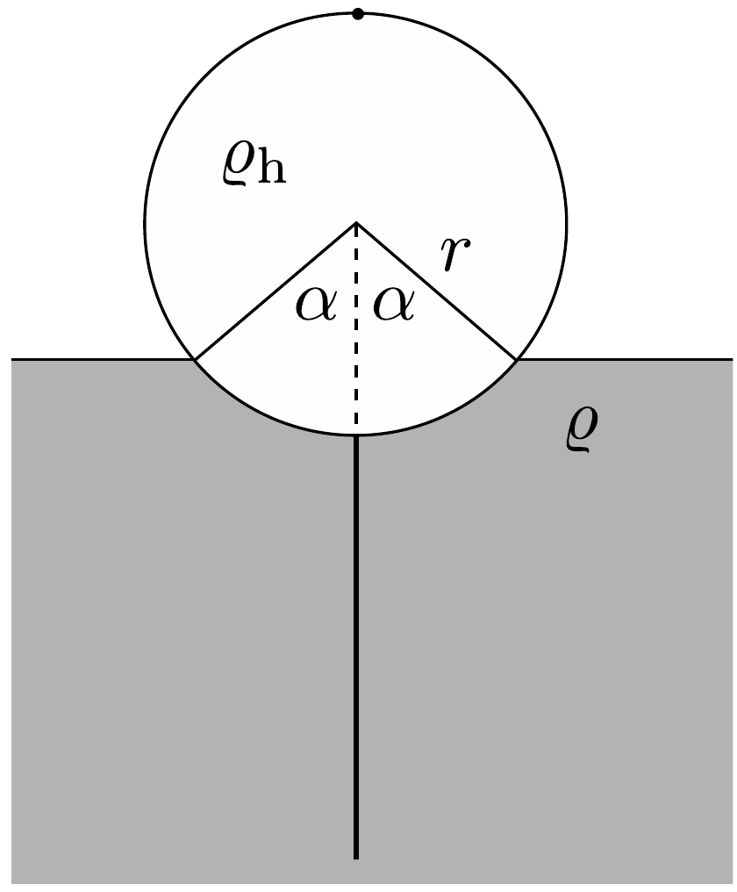
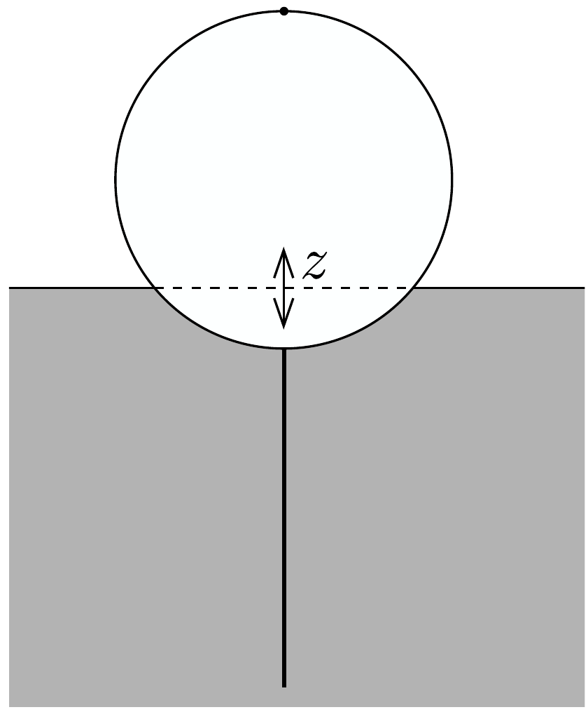
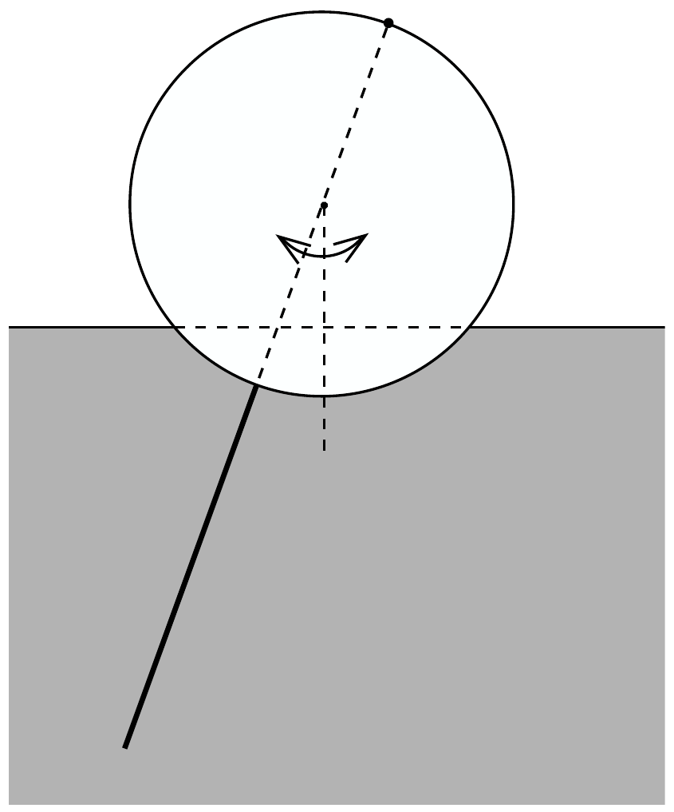

## Feladat 3

Henger alakú bója
a) Egy $r$ sugarú, $\ell$ hosszúságú, tömör, henger alakú, homogén tömegeloszlású bója nagyon könnyü, $\varrho_{\mathrm{h}}$ sürúségú anyagból készült. A bójának további része egy homogén, merev rúd, amely a hengeres rész közepénél a henger tengelyére merőlegesen nyúlik ki a hengerpalástból. A rúd tömege megegyezik a henger tömegével, a hossza pedig ugyanakkora, mint a henger átmérője. A rúd súrúsége sokkal nagyobb, mint a tengervízé, a rúd átméróje pedig elhanyagolhatóan kicsi.

Ez a bója $\varrho$ súrúségú tengervízben úszik. Vezessük le azt az összefüggést, amely megadja a 188. ábrán látható $\alpha$ úszási szöget $\varrho_{\mathrm{h}} / \varrho$-val kifejezve!

b) Ha valamilyen zavar következtében a bója egy kicsiny $z$ értékkel függőlegesen lesüllyed, eredő emelőerőt fog érezni, aminek következtében föl-le rezegni kezd az úszási egyensúlyi helyzete körül (189. ábra). Határozzuk meg ennek a függőleges rezgésnek a frekvenciáját $\alpha, g$ és $r$ segítségével ( $g$ a gravitációs gyorsulás)! A víz mozgásának hatását úgy vehetjük figyelembe, mintha a bója tömege az eredeti érték 1/3-ával megnövekedne. Feltehetjük, hogy az $\alpha$ szög nem nagyon kicsi.

c) Abban a közelítésben, hogy a henger vízszintes szimmetriatengelye körül végez ingaszerú lengéseket (190. ábra), határozzuk meg a lengés frekvenciáját ismét $g$ és $r$ segítségével ${ }^{14}$ Hanyagoljuk el a víz mozgását és belső súrlódását ebben az esetben. Feltételezhető, hogy a lengések szöge kicsi.

\footnotetext{
${ }^{14}$ A valóságban a rezgés nem így jön létre, hanem úgy, hogy a rendszer tömegközéppontja (ami a rúd és a hengerpalást érintkezési pontjánál van) vízszintesen ne mozduljon el, hiszen nincs olyan irányú külső erő. A feladat szövegében leírt mozgás csak külső kényszer, a bója hengere szimmetriatengelyének rögzítésével érhető el. Sajnálatos módon a Newton-törvényekkel való hasonló ellentmondás már egyszer, az 1988-as versenyen megtörtént.

d) A bójában érzékeny gyorsulásmérőket helyeztek el, melyek a függőleges és a lengő mozgást mérik, és az adatokat rádió segítségével továbbítják a partra. Viszonylag nyugodt vízben azt észleljük, hogy a függőleges rezgés periódusideje 1 másodperc körüli, míg a lengés periódusideje 1,5 másodperc körüli érték. Ebből az információból kiindulva mutassuk meg, hogy az $\alpha$ úszási szög közel 90°, majd határozzuk meg a bója sugarát és teljes tömegét annak ismeretében, hogy a henger $\ell$ hossza $r$-rel egyenlő!

Közelító adatok: $\rho=1000 \mathrm{~kg} / \mathrm{m}^{3}$ és $g=9,8 \mathrm{~m} / \mathrm{s}^{2}$.
