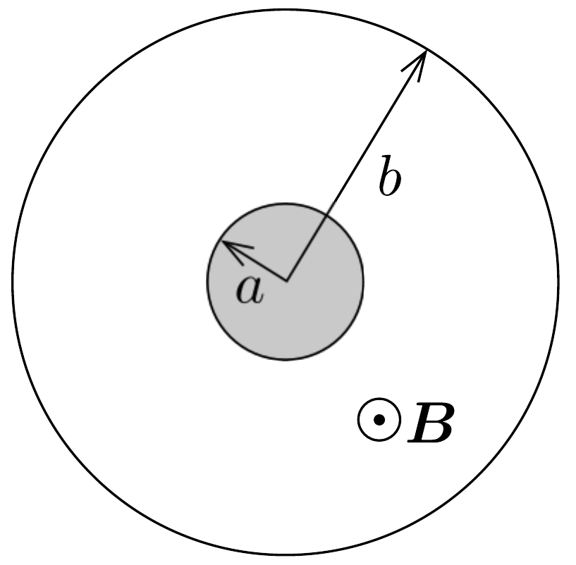

## Feladat 2

Két azonos tengelyú, hengeres vezető között légritkított tér van. A belső henger sugara $a$, a külső henger belső sugara $b$, amint ezt a 200. ábra mutatja. A külső hengerre, amit nevezzünk anódnak, a belső hengerhez képest pozitív $V$ feszültség kapcsolható. A hengerek tengelyével párhuzamos, homogén, állandó, az ábra síkjából felénk mutató $\boldsymbol{B}$ mágneses tér is fellép. A vezetőkben létrejövő töltésmegosztás elhanyagolható.

A következőkben $m$ tömegü és $-e$ töltésú elektronok mozgását vizsgáljuk. Az elektronok a belső henger felületéről lépnek ki.

a) Először a $V$ feszültséget bekapcsoljuk, de $\boldsymbol{B}=0$. Egy elhanyagolható sebességú elektron szabadul ki a belső henger felületéről. Határozzuk meg az elektron $v$ sebességét abban a pillanatban, amikor becsapódik az anódba! A sebességet határozzuk meg nemrelativisztikus és relativisztikus tárgyalásmóddal is!

A továbbiakban már csak a nemrelativisztikus tárgyalást használjuk.
b) Most $V=0$, de a homogén $\boldsymbol{B}$ mágneses mezó jelen van. Egy elektron indul ki $v_{0}$ kezdősebességgel sugárirányban. Ha a mágneses tér nagyobb egy bizonyos kritikus $B_{\mathrm{c}}$ értéknél, akkor az elektron nem éri el az anódot. Készítsünk vázlatos rajzot az elektron pályájáról, ha $B$ egy kissé nagyobb, mint $B_{\mathrm{c}}$. Határozzuk meg $B_{\mathrm{c}}$ értékét!

Mostantól kezdve a $V$ feszültség és a $\boldsymbol{B}$ homogén mágneses mező is jelen van.
c) A mágneses mező az elektronnak a hengerek tengelyére vonatkoztatva valamekkora $L$ impulzusmomentumot (perdületet) ad. Állítsunk fel egy egyenletet az impulzusmomentum $\mathrm{d} L / \mathrm{d} t$ változási sebességére! Mutassuk meg, hogy ebből az egyenletből következik, hogy az $L-k e B r^{2}$ kifejezés a mozgás során mindvégig állandó, ahol $k$ egy meghatározott szám! Itt $r$ a henger tengelyétől mért távolság. Határozzuk meg $k$ számértékét!
d) Tekintsünk egy, a belső hengerből elhanyagolható sebességgel kilépő elektront, amely nem éri el az anódot, hanem a henger tengelyétől $r_{\mathrm{m}}$ maximális távolságra távolodik. Határozzuk meg $r_{\mathrm{m}}$ függvényében az elektron $v$ sebességét abban a pontban, ahol a henger tengelyétől mért távolsága maximális!
e) Az anódra érkező elektronáramot szeretnénk a mágneses térrel szabályozni. Ha $B$ nagyobb, mint egy kritikus $B_{\mathrm{c}}$ mágneses mező, akkor egy elektron, amely elhanyagolható sebességgel lép ki, nem éri el az anódot. Határozzuk meg $B_{\mathrm{c}}$ értékét!
f) Abban az esetben, ha az elektronok a belső henger fütésének hatására lépnek ki, általában nullától különböző kezdősebességgel rendelkeznek a belső henger felületén. A kezdősebesség $\boldsymbol{B}$ vektorral párhuzamos komponense $v_{B}$, a $\boldsymbol{B}$ vektorra merőleges komponensei pedig $v_{r}$ (sugárirányban), illetve $v_{\varphi}$ (érintő irányban, azaz a sugárirányra merőlegesen). Határozzuk meg ebben az esetben az anód eléréséhez szükséges kritikus $B_{\mathrm{c}}$ mágneses mezőt!

